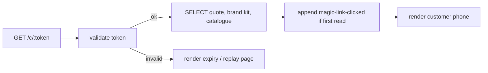
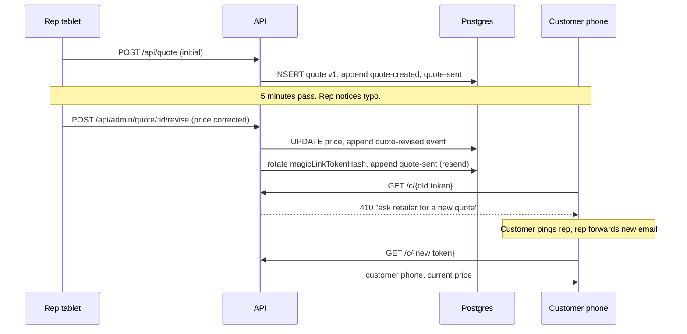

The customer can hit the magic link at any moment: the morning after a deploy, fourteen days after the rep sent it, while the rep is mid-edit on the rep tablet, after the retailer's session expired in the admin portal. Every one of these has to land on a coherent surface. This page specifies the rules.

## Principles

1. **Idempotent quote read.** Every `GET /api/quote/by-token/{token}` is a pure read. It never mutates the quote row; only the audit log appends.
2. **Audit-log replay.** The current state of a quote is always reproducible from `INSERT`s into `audit_events` plus the immutable `quotes` row. No status field is the source of truth on its own; it is a materialised projection.
3. **Server stateless on cold start.** Vercel route handlers can spin up cold. There is nothing in process memory that matters. State lives in Postgres and KV.
4. **Graceful expiry messaging.** A customer hitting an expired link sees a polite "ask your retailer for a new quote" page with the retailer's contact, not a stack trace.
5. **No silent state loss.** If the rep edits a quote after the magic link is sent, the customer's view reflects that edit on next read. Nothing about the original quote disappears.

## Server cold-start

The customer page is a server component. It runs on every request. The cold path is identical to the warm path:

There is no in-memory cache. Each request reads from Postgres. The only ephemeral state is the KV nonce blocklist, which is durable enough for the token TTL.

If Vercel KV is unreachable, validation falls back to: signature ok + expiry ok + status not `acknowledged`. This degrades replay protection to "best effort" but keeps the customer surface available. A KV outage is logged and surfaced on the admin dashboard as a degraded-mode banner.

## Token expiry

The quote row carries `expiresAt`. The token's `exp` matches it. Two clocks are checked because the token may be reissued mid-life by an admin "resend" action with a longer TTL.

| Time | Status before | Customer sees | Audit event |
|---|---|---|---|
| Within TTL, first click | `sent` | Customer phone surface | `magic-link-clicked` |
| Within TTL, repeat click (same nonce) | `opened` or later | Replay page or post-ack receipt | None on replay page; the receipt page is a re-render of the persisted state |
| After TTL, status pre-`acknowledged` | `sent` / `opened` / `option-picked` | "This quote has expired. Ask your retailer for a new quote." | `quote-expired` (system, idempotent) |
| After TTL, status `acknowledged` | `acknowledged` | Post-acknowledgement receipt page | None |

`quote-expired` is appended once on the first read after expiry. A scheduled job sweeps every hour and appends `quote-expired` for any `sent`/`opened`/`option-picked` row whose `expiresAt` has passed, so the dashboard stays consistent even without a customer click.

## Customer arrives mid-edit

Edge case: the rep changes the price after the magic link was sent, or resends the link with new details. The system handles this via mutation through audit events, not in-place edits.

Every revise resets the token hash, so any link in flight to the customer is dead. The customer always sees the latest version. The audit timeline shows the revision and the resend.

If the rep needs to change the customer's email (typo, different address), the same flow applies: revise, regenerate token, resend.

## Concurrent acknowledgement and edit

If the customer clicks confirm at the exact moment the rep is mid-revise, the database resolves it as serialisable transactions. Either:

- **Customer wins the race.** Acknowledgement transitions status to `acknowledged`. The rep's revise call returns 409 with "this quote is already acknowledged; create a new one".
- **Rep wins the race.** Revise commits first. The customer's `acknowledge` call sees the new token hash, fails token validation on the server-side check, and the customer surface re-renders an "ask retailer for a new quote" page.

The 409 surfaces in the admin portal banner: "This quote was acknowledged before you could revise it. Issue a new quote to change anything."

## Admin session expiry

Admin sessions are short-lived (4 hours, then refresh required). Cold-start recovery for admin is a redirect to login on session expiry, then back to the requested page after authentication. No state is held in the session beyond identity and RBAC role; the page reloads its data every time.

## Demo cold-start

The demo's "cold start" is a browser refresh.

| Trigger | Behaviour |
|---|---|
| Reload `/demo/rep` | Skin restores from localStorage. `inFlightQuote` restores. The form is pre-filled where the rep left off. |
| Reload `/demo/customer/[token]` | Reads `inFlightQuote` from Zustand. If absent (e.g. localStorage cleared), renders the skin's `defaultScenario` so the demo always works. |
| Reload `/demo/admin` | Reads from `lib/fixtures.ts`, which is deterministic via a fixed seed. Same numbers every time. |
| Skin switch mid-flow | Walkthrough resets to step 0; in-flight quote is cleared. |

The walkthrough step is intentionally not persisted. Every fresh visitor lands on step 0 of the scripted tour.

## Replay safety

Replay is the security concern that drives most of the cold-start design. The two relevant defences:

1. **Nonce blocklist.** A second click of the same magic link, within TTL, lands on the replay page. The blocklist key is `nonce:<base64url>`, TTL = `exp - now`.
2. **Token rotation on revise.** Any change to the quote rotates the token hash, invalidating prior tokens.

Replay is logged but does not trigger lockouts. The customer pings the rep, the rep resends, the customer reads the new link. This is the expected flow for an edge case and not worth UX friction.
