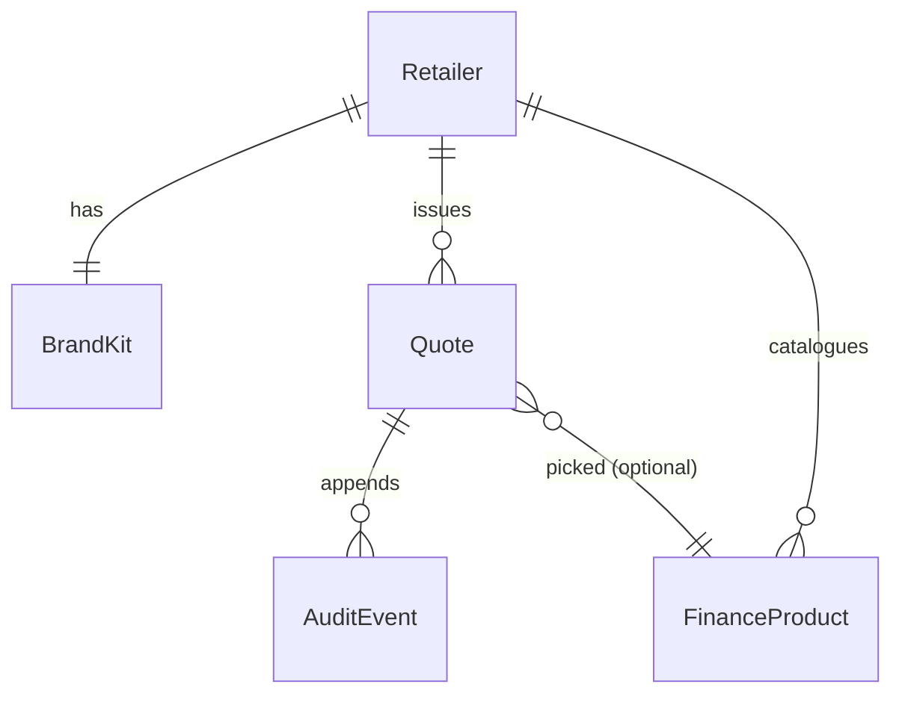

The demo's types live in `lib/`. The production database extends them with a `Quote` row and a `Retailer` row, both keyed by stable IDs. This page reproduces the shapes verbatim from source, then specifies the production extensions and Zod schemas.

## RetailerSkin

Defined in `lib/skins.ts`. Three skins ship in the demo: `solaris`, `hayes`, `bright-lane`.

```typescript
export type SkinId = "solaris" | "hayes" | "bright-lane";

export interface RetailerSkin {
  id: SkinId;
  name: string;
  shortName: string;
  vertical: string;
  tagline: string;
  fcaRegisterNumber: string;
  footerText: string;
  productLabel: string;
  defaultScenario: {
    description: string;
    price: number;
    depositPercent: number;
    customerName: string;
    customerEmail: string;
    customerMobile: string;
  };
  /** Display metadata for the skin switcher tile. */
  swatchHex: string;
}
```

In production, `RetailerSkin` is sourced from the `retailers` and `brand_kits` tables and joined into the rep tablet bootstrap response. `defaultScenario` does not survive into production; it is demo-only seed data.

## FinanceProduct

Defined in `lib/catalogue.ts`.

```typescript
export type FinanceProductType = "cash" | "ifc" | "monthly" | "bnpl";

export interface FinanceProduct {
  /** Stable identifier within a skin's catalogue. */
  id: string;
  type: FinanceProductType;
  /** Short display name, e.g. "12 months interest free". */
  name: string;
  /** One-line key feature, surfaced on the rep tablet card. */
  keyFeature: string;
  /** Term in months. 0 for cash. */
  termMonths: number;
  /** APR as a decimal, e.g. 0.149 for 14.9%. 0 for cash and IFC. */
  apr: number;
  /** Lender display name for footer attribution. Null for cash. */
  lender: string | null;
  /**
   * Deferred period in months for BNPL products. During this window
   * no payments are required and (for some BNPL terms) no interest
   * accrues if the balance is settled in full before the deferred
   * window ends.
   */
  deferredMonths?: number;
  /** Minimum deposit required for this product, as a percent. */
  minDepositPercent?: number;
}
```

Product types and their semantics:

| Type | APR | Term | Notes |
|---|---|---|---|
| `cash` | 0 | 0 | Self-funded. No credit agreement. |
| `ifc` | 0 | Fixed | Interest-free credit. Equal monthly instalments. |
| `monthly` | Non-zero | Fixed | Annuity amortisation at APR. |
| `bnpl` | Non-zero | Fixed, with `deferredMonths` | Payments deferred at the start. Settle in full before the deferred window ends to pay no interest. |

## ComputedQuote

Defined in `lib/finance-math.ts`. The output of `computeQuote(product, price, depositPercent)`.

```typescript
export interface ComputedQuote {
  /** Cash deposit £ amount. */
  deposit: number;
  /** Amount of credit £, the principal financed. */
  amountOfCredit: number;
  /** Term in months. 0 for cash. */
  termMonths: number;
  /** Monthly payment £, 0 for cash. */
  monthlyPayment: number;
  /** Total amount payable £, including deposit. */
  totalPayable: number;
  /** Total interest £, 0 for cash and IFC. */
  totalInterest: number;
  /** Effective APR as a decimal. */
  apr: number;
  /** Deferred period in months, undefined for non-BNPL. */
  deferredMonths?: number;
}
```

APR is treated as the nominal annual rate compounded monthly. The monthly rate is `apr / 12`. UK regulated APR uses XIRR-style daily compounding under CONC App 1; the production build implements that exactly. The demo's shape is realistic enough for the comparison cards.

## InFlightQuote

Defined in `lib/state.ts`. The quote being built on the rep tablet, persisted to localStorage so the customer surface can read it inside the demo.

```typescript
export interface InFlightQuote {
  description: string;
  price: number;
  depositPercent: number;
  customerName: string;
  customerEmail: string;
  customerMobile: string;
  /** Set when the rep selects "customer present, ack now" instead of magic link. */
  inStoreFallback: boolean;
}
```

In production, the equivalent payload is the body of `POST /api/quote`.

## CustomerAcknowledgement

Defined in `lib/state.ts`. The customer's input on the phone surface.

```typescript
export interface CustomerAcknowledgement {
  pickedProductId: string | null;
  targetMonthly: number | null;
  acknowledgements: {
    minimumRepayment: boolean;
    canOverpay: boolean;
    contactLender: boolean;
    creditAgreement: boolean;
  };
  confirmedAt: string | null;
}
```

The four boolean flags map to CONC 4.2 adequate-explanation requirements. All four must be `true` and `confirmedAt` must be set before the quote transitions to `acknowledged`.

## AdminQuote

Defined in `lib/fixtures.ts`. The admin-portal-shaped projection of a quote.

```typescript
export type QuoteStatus =
  | "sent"
  | "opened"
  | "option-picked"
  | "acknowledged"
  | "expired";

export interface AdminQuote {
  id: string;
  skinId: SkinId;
  /** ISO timestamp the quote was created. */
  createdAt: string;
  rep: string;
  customerName: string;
  customerEmail: string;
  description: string;
  /** Headline price £. */
  price: number;
  depositPercent: number;
  status: QuoteStatus;
  /** ID from catalogue.ts of the option the customer picked, if any. */
  pickedOptionId: string | null;
  /** Audit trail. Fixtures generate timeline entries that match status. */
  events: AuditEvent[];
}
```

## AuditEvent

```typescript
export interface AuditEvent {
  /** ISO timestamp. */
  at: string;
  type:
    | "quote-created"
    | "quote-sent"
    | "magic-link-clicked"
    | "option-picked"
    | "acknowledgements-confirmed"
    | "quote-expired";
  by: "rep" | "customer" | "system";
  description: string;
  detail?: Record<string, string | number>;
}
```

Audit events are append-only. A quote is fully reconstructible by replaying its events in order. See [cold-start recovery](/architecture/cold-start-recovery/) for replay rules.

## Production Quote row

The persisted row that backs `AdminQuote`. This is what the production database stores.

```typescript
export interface Quote {
  /** ULID. Used in URLs as `/admin/quote/[id]`. */
  id: string;
  retailerId: string;
  /** Skin selector. Resolved at request time, not denormalised. */
  skinId: SkinId;
  repName: string;
  customerName: string;
  customerEmail: string;
  customerMobile: string | null;
  description: string;
  price: number;
  depositPercent: number;
  status: QuoteStatus;
  pickedOptionId: string | null;
  /** ISO timestamp. */
  createdAt: string;
  /** ISO timestamp. Magic link is invalid after this. */
  expiresAt: string;
  /** SHA-256 of the issued token. The plaintext token never persists. */
  magicLinkTokenHash: string;
}
```

`magicLinkTokenHash` is a one-way hash. The plaintext token is delivered once via email. If the customer loses it, the rep reissues a new one, which produces a new hash and invalidates the old.

## Retailer row

```typescript
export interface Retailer {
  id: string;
  legalName: string;
  shortName: string;
  fcaRegisterNumber: string;
  footerText: string;
  contractTier: "pilot" | "active" | "suspended";
  /** Live skin definition. Brand kit lives in a separate row. */
  skinId: SkinId;
  createdAt: string;
}

export interface BrandKit {
  retailerId: string;
  brandPrimaryHex: string;
  logoSvg: string;
  /** Shadow of skins.ts at write time, for cold-start branding. */
  productLabel: string;
}
```

## Relationships



- A retailer has exactly one brand kit.
- A retailer issues many quotes.
- A quote appends many audit events.
- A quote may reference one finance product as its picked option.
- A retailer's catalogue is many finance products.

## Zod schemas

Validation runs at every API entry point and at the customer-form step on the rep tablet.

```typescript
import { z } from "zod";

export const SkinIdSchema = z.enum(["solaris", "hayes", "bright-lane"]);

export const FinanceProductTypeSchema = z.enum([
  "cash",
  "ifc",
  "monthly",
  "bnpl",
]);

export const FinanceProductSchema = z.object({
  id: z.string().min(1),
  type: FinanceProductTypeSchema,
  name: z.string().min(1),
  keyFeature: z.string().min(1),
  termMonths: z.number().int().min(0).max(240),
  apr: z.number().min(0).max(0.5),
  lender: z.string().nullable(),
  deferredMonths: z.number().int().min(0).max(12).optional(),
  minDepositPercent: z.number().min(0).max(95).optional(),
});

export const QuoteCreateSchema = z.object({
  description: z.string().min(2).max(200),
  price: z.number().positive().max(250_000),
  depositPercent: z.number().min(0).max(95),
  customerName: z.string().min(2).max(120),
  customerEmail: z.string().email().max(200),
  customerMobile: z.string().regex(/^\+?[0-9 ]{8,20}$/).optional(),
  inStoreFallback: z.boolean().default(false),
});

export const QuoteStatusSchema = z.enum([
  "sent",
  "opened",
  "option-picked",
  "acknowledged",
  "expired",
]);

export const AcknowledgementSchema = z.object({
  pickedProductId: z.string().min(1),
  targetMonthly: z.number().nonnegative().nullable(),
  acknowledgements: z.object({
    minimumRepayment: z.literal(true),
    canOverpay: z.literal(true),
    contactLender: z.literal(true),
    creditAgreement: z.literal(true),
  }),
});

export const AuditEventSchema = z.object({
  at: z.string().datetime(),
  type: z.enum([
    "quote-created",
    "quote-sent",
    "magic-link-clicked",
    "option-picked",
    "acknowledgements-confirmed",
    "quote-expired",
  ]),
  by: z.enum(["rep", "customer", "system"]),
  description: z.string().min(1),
  detail: z.record(z.union([z.string(), z.number()])).optional(),
});
```

The acknowledgement schema uses `z.literal(true)` for each tickbox: a `false` payload fails validation at the API edge, before any state mutation runs.
