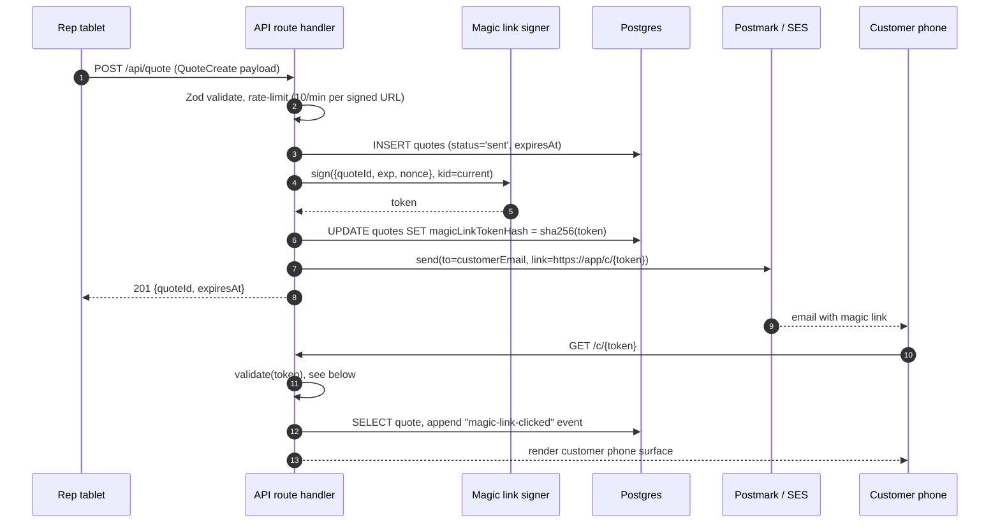

The magic link is the only handoff between rep and customer. It carries no session, no cookie, no app install. It points at a single quote and expires. Tokens are signed server-side with a rotated HMAC key, validated on every read, and revoked on first acknowledgement.

The demo skips signing entirely; the customer route accepts any string in the `[token]` slot. This page specifies the production scheme.

## Token format

Three base64url-encoded segments separated by dots, mirroring the JWT shape without using JWS:

```
<header>.<payload>.<signature>
```

The format is deliberately compact and URL-safe.

### Header

```typescript
interface TokenHeader {
  /** Algorithm. Always "HS256". */
  alg: "HS256";
  /** Key id. Selects which signing key validates this token. */
  kid: string;
  /** Token version. Bump if the payload shape changes. */
  v: 1;
}
```

The `kid` lets the validator pick the right key during a rotation window. New tokens issue under the latest `kid`; in-flight tokens issued under the previous `kid` continue to validate until they expire or are rotated out.

### Payload

```typescript
interface TokenPayload {
  /** Quote id (ULID). The token names exactly one quote. */
  quoteId: string;
  /** Issued-at, unix seconds. */
  iat: number;
  /** Expiry, unix seconds. Hard limit, server-validated. */
  exp: number;
  /** Single-use nonce. 16 bytes, base64url. Blocklisted on first use. */
  nonce: string;
}
```

There is no `sub`, no `aud`, no `iss`. The token is a bearer reference to a server-side row, not a session.

### Signature

```
signature = base64url(
  hmac_sha256(
    key = SIGNING_KEYS[kid],
    message = base64url(header) + "." + base64url(payload),
  )
)
```

The MAC covers the encoded header and payload, joined by a single `.`. This binds the `kid`, the payload, and the version into one tamper-evident envelope.

## Issuance



## Validation

Every customer-page read runs the same five checks in order. A failed check returns a generic "this link has expired or is invalid" page.

```typescript
function validate(token: string): Result<{ quoteId: string }, ValidationError> {
  // 1. Parse three base64url segments. Reject malformed.
  const { header, payload, signature } = parseToken(token);

  // 2. Check version. Reject unknown versions.
  if (header.v !== 1) return { ok: false, code: "version" };

  // 3. Look up signing key by kid. Reject if kid is unknown
  //    or has been rotated out of validity.
  const key = SIGNING_KEYS[header.kid];
  if (!key || !key.valid) return { ok: false, code: "kid" };

  // 4. Constant-time compare the HMAC over header+payload.
  const expected = hmacSha256(key.secret, encode(header) + "." + encode(payload));
  if (!timingSafeEqual(expected, signature)) {
    return { ok: false, code: "signature" };
  }

  // 5. Expiry check.
  if (payload.exp <= unixNow()) return { ok: false, code: "expired" };

  // 6. Nonce blocklist (KV). If we've seen this nonce before,
  //    treat as replay. Otherwise add it with TTL = exp - now.
  const seen = await kv.get(`nonce:${payload.nonce}`);
  if (seen) return { ok: false, code: "replay" };
  await kv.set(`nonce:${payload.nonce}`, "1", { ex: payload.exp - unixNow() });

  return { ok: true, value: { quoteId: payload.quoteId } };
}
```

The nonce blocklist is the replay defence. Once a customer has clicked the link, the nonce is stored in Vercel KV with a TTL matching the token's remaining lifetime. A second click within the TTL is rejected.

Acknowledgement is idempotent at the application layer (the `acknowledged` status is terminal), so a benign reload of the customer page does not break anything; the user just sees the post-acknowledgement view served from the database row, not a re-validation of the original token.

## Key rotation

Two signing keys are kept live at any time: `current` and `previous`. New tokens always issue under `current`. Existing tokens issued under `previous` continue to validate until either they expire naturally or `previous` is retired.

```typescript
interface SigningKey {
  kid: string;
  secret: Buffer;
  valid: boolean;
  /** Created. Used to pick the newest 'current'. */
  createdAt: string;
  /** Set when this key has been retired. Tokens under it become invalid. */
  retiredAt: string | null;
}
```

Rotation policy:

| Trigger | Action |
|---|---|
| Quarterly schedule | Generate new `current`. Demote old `current` to `previous`. Retire old `previous`. |
| Suspected compromise | Immediate rotation. Retire compromised key. Force-expire all live magic links by clearing the issuing `kid`'s nonces from KV. |
| Staff exit | Rotate within 24 hours if the leaver had production access. |

The rotation is a single deploy. Old tokens issued under a retired `kid` fail step 3 of validation.

## Environment variables

| Var | Where | Example | Notes |
|---|---|---|---|
| `MAGIC_LINK_SIGNING_KEY_CURRENT` | Server only | base64-encoded 32 bytes | The active HMAC key. |
| `MAGIC_LINK_KID_CURRENT` | Server only | `2026-q2` | Identifier for the active key. |
| `MAGIC_LINK_SIGNING_KEY_PREVIOUS` | Server only | base64-encoded 32 bytes | The recently-rotated key, still valid for in-flight tokens. |
| `MAGIC_LINK_KID_PREVIOUS` | Server only | `2026-q1` | Identifier for the previous key. |
| `MAGIC_LINK_TTL_HOURS` | Server only | `336` (14 days) | TTL for new tokens. Bound by FCA reasonable response window. |
| `MAGIC_LINK_BASE_URL` | Server only | `https://app.example.com/c/` | Prefix prepended when building the email link. |

Keys must be at least 32 bytes of cryptographic randomness. Generate with `openssl rand -base64 32`.

## Rate limits

Three ceilings, enforced via Vercel KV counters keyed per-resource:

| Surface | Limit | Key | Notes |
|---|---|---|---|
| Quote creation | 10 / minute | per signed retailer URL | Stops a leaked URL from spamming the email service. |
| Magic-link open | 5 / minute | per token | Customer reloads, retries, prefetchers. |
| Admin reads | 30 / minute | per session | Admin portal pagination and refreshes. |

Counters expire after 60 seconds. Exceeding a limit returns 429. The customer-facing 429 redirects to a retry page with a "try again in 60 seconds" message.

## Error states

| Code | Surface message | HTTP |
|---|---|---|
| `malformed` | "This link is invalid." | 400 |
| `version` | "This link is invalid." | 400 |
| `kid` | "This link is no longer valid. Ask your retailer for a new quote." | 410 |
| `signature` | "This link is invalid." | 400 |
| `expired` | "This quote has expired. Ask your retailer for a new quote." | 410 |
| `replay` | "This quote has already been opened. Use the same device or ask for a new link." | 410 |

Surface messages are deliberately generic. The internal code is logged for diagnostics and admin display; the customer never sees it.

## What lives where

| Concern | Demo | Production |
|---|---|---|
| Token | Static string in URL | HMAC-SHA256, base64url, three segments |
| Validation | None (any string accepted) | Five-step check, server-side |
| Replay protection | None | Nonce blocklist in Vercel KV |
| Key rotation | n/a | Quarterly + on-demand, two-key window |
| TTL | n/a | `MAGIC_LINK_TTL_HOURS`, default 14 days |
| Email delivery | Mocked | Postmark or SES |

The demo token slot exists only to make the customer route URL look real. It is not an authentication seam.
