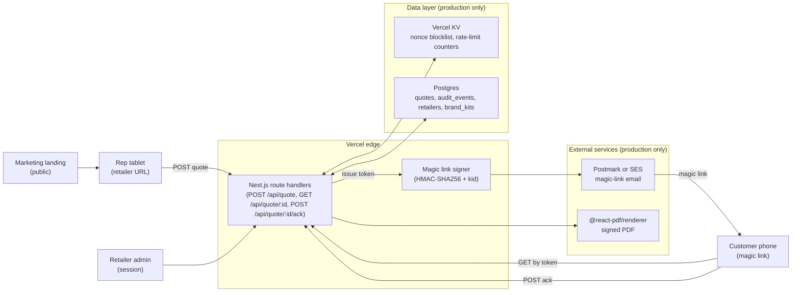

Lending Agent Presenter is four surfaces over one quote object. A retailer signs a URL, the rep types a quote, the customer acknowledges on their own device, the retailer audits. The demo runs entirely in the browser. The production build adds a thin server layer for signing, persistence, and email.

## Surfaces

| Surface | Path | Audience | Auth |
|---|---|---|---|
| Marketing landing | `/` | Public | None |
| Rep tablet | `/demo/rep` | In-store sales rep | Signed retailer URL + rep-name capture |
| Customer phone | `/demo/customer/[token]` | Quoted customer | Magic-link token |
| Retailer admin | `/demo/admin`, `/demo/admin/list`, `/demo/admin/quote/[id]` | Retailer back office | Session (planned) |

Each surface is a Next.js App Router route. Surfaces share a Zustand store for in-flight quote handoff inside the demo. In production, the rep tablet POSTs the quote to the API and the customer page GETs by token.

## High-level architecture

## In-flight quote handoff

Inside the demo, the rep tablet writes an `InFlightQuote` to the Zustand store and the customer route reads it. There is no server. The token in `/demo/customer/[token]` is decorative.

In production, the rep tablet sends the quote to `POST /api/quote`. The server creates the row, generates a magic-link token, sends the email, and returns. The rep UI shows a confirmation. The customer receives a link of the form `/c/<token>` and the server validates the token before rendering the page.

## Mock vs real boundary

| Concern | Demo | Production |
|---|---|---|
| State | Zustand `persist` to localStorage | Postgres + Vercel KV |
| Token signing | Plain string in URL | HMAC-SHA256 with rotated `kid` |
| Email | None | Postmark or SES |
| SMS | None | MessageBird or Twilio (optional) |
| PDF | Styled HTML accordion | `@react-pdf/renderer`, stored on Vercel Blob |
| Audit log | Hardcoded fixtures | `audit_events` table, append-only |
| RBAC | None | Admin / auditor / read-only roles |
| Rate limiting | None | Per-token and per-session ceilings via KV |

See [Mock vs real](/architecture/mock-vs-real/) for the full diff.

## Key invariants

1. **Every contracted finance option renders for every quote.** The rep cannot suppress an option. The catalogue is the source of truth and `lib/finance-math.ts` computes against all of it.
2. **Customer acknowledgement happens on the customer's own device.** The in-store fallback exists for accessibility, not as the default.
3. **The audit log is append-only.** Edits to a quote create new events; nothing is mutated in place.
4. **Magic links are single-use within their TTL.** A nonce blocklist prevents replay; expiry is server-validated.
5. **The retailer holds FCA credit-broking permission.** Lending Agent Presenter is SaaS tooling. See [permissions and contracts](/implementation/brokers/permissions-contracts/).

## Source files

The demo's authoritative shapes live in `lib/`:

- `lib/skins.ts`: `RetailerSkin`, `SkinId`, three skin definitions
- `lib/catalogue.ts`: `FinanceProduct`, `FinanceProductType`, per-skin catalogues
- `lib/finance-math.ts`: `ComputedQuote`, deposit/monthly/total/target maths
- `lib/fixtures.ts`: `AdminQuote`, `AuditEvent`, `QuoteStatus`, twenty quotes per skin
- `lib/state.ts`: `InFlightQuote`, `CustomerAcknowledgement`, Zustand store
- `lib/walkthrough.ts`: `WalkthroughStep`, scripted-mode step machine

The [data model](/architecture/data-model/) reproduces these types verbatim alongside the planned production `Quote` row.
