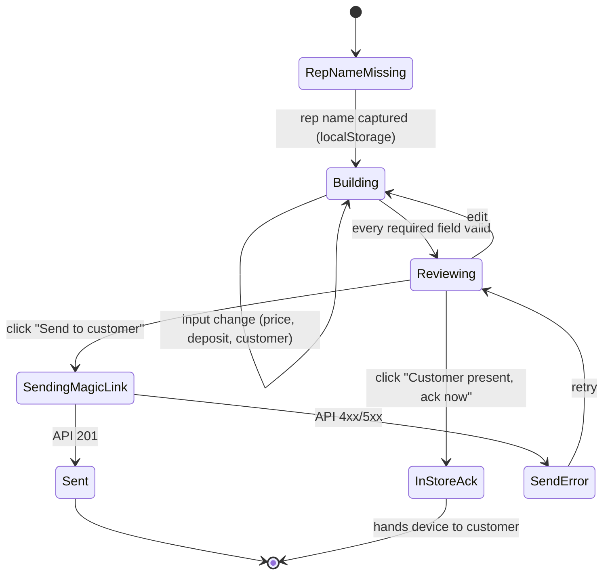
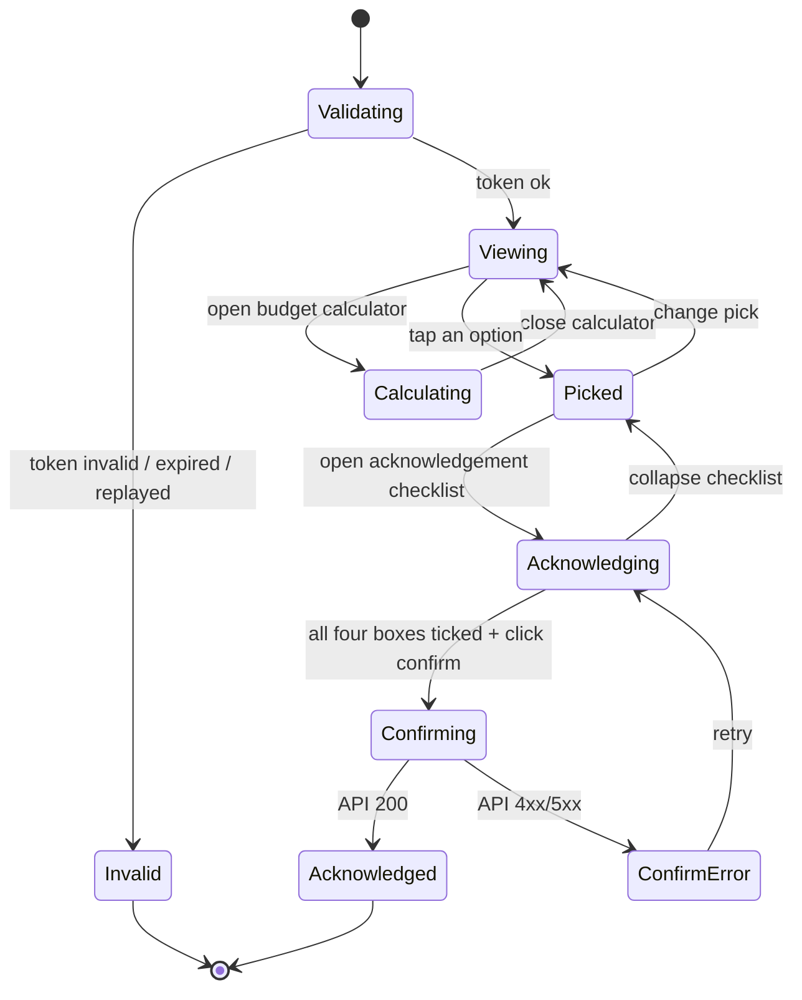
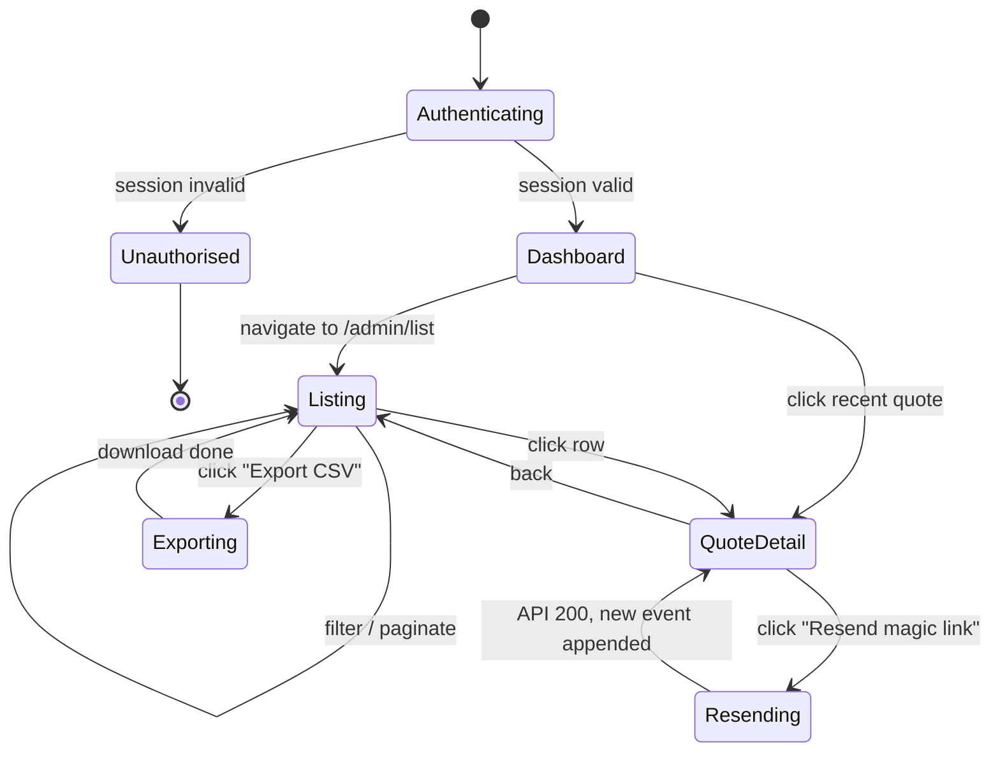
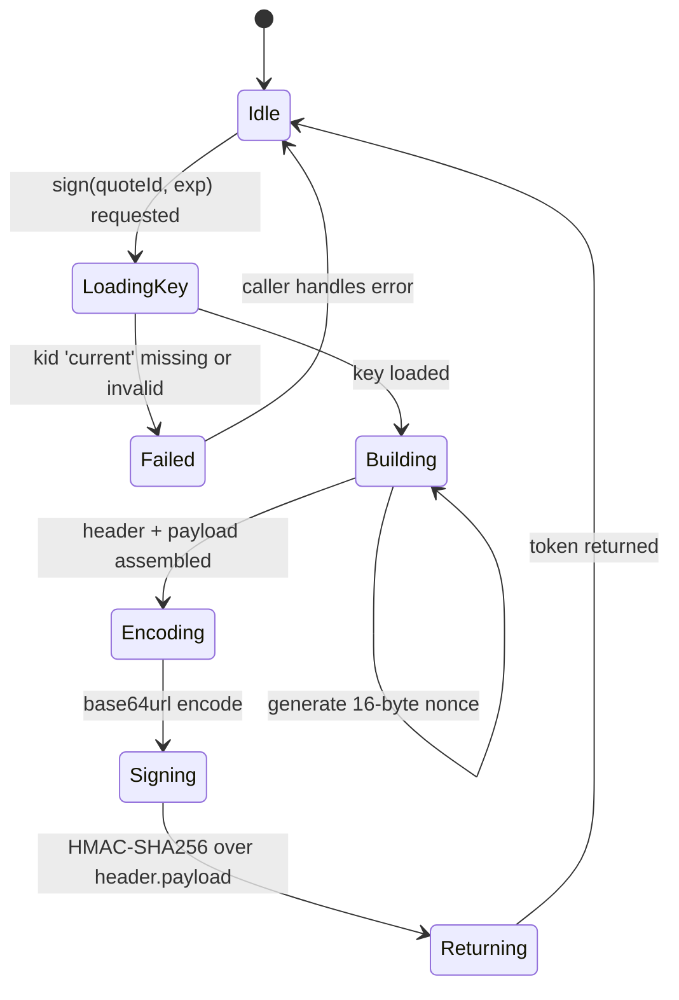
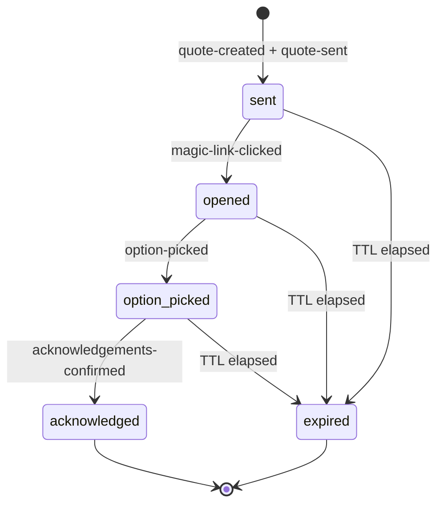

Lending Agent Presenter has four small state machines, one per surface. They are kept independent so each can be reasoned about, instrumented, and tested in isolation. None of them are AI-driven.

## Rep tablet

The rep tablet is a one-page builder. It begins blank, captures the rep's name once per device, fills the form, and ends on send.

| State | Persisted | Notes |
|---|---|---|
| `RepNameMissing` | localStorage `repName` | Modal blocks input until the rep types a name. |
| `Building` | Zustand store | Live finance product cards re-render on every keystroke. |
| `Reviewing` | Zustand store | Send button enabled. |
| `SendingMagicLink` | None | API call in flight. |
| `Sent` | Server | `quote-created` and `quote-sent` events appended. |
| `InStoreAck` | Zustand store | Same surface re-renders the customer view inline. |

## Customer phone

The customer arrives via magic link. The page validates the token, renders the quote, captures a pick, runs through the four acknowledgement tickboxes, and confirms.

The four tickboxes are the CONC 4.2 adequate-explanation acknowledgements: minimum repayment, can overpay, contact lender to apply overpayments, this is a credit agreement.

## Retailer admin

The admin portal is read-mostly. The state machine here is per-page rather than per-session: each page loads, paginates, and filters.

Resending a magic link is the only mutation an admin can make. It generates a new token (under `current` `kid`), stores its hash, and appends a `quote-sent` event. The previous hash is overwritten; the previous token becomes uncallable on next validation.

## Magic-link issuance

The signer is a small state machine of its own, called from the API route handler. It owns the keys, the nonce, and the token assembly.

On the validation side, the signer's complement runs the five-step check from [magic-link mechanics](/architecture/magic-link-mechanics/).

## Status-field state machine

The `QuoteStatus` field on the persisted quote row is the union of all customer-facing transitions. Audit events append for every transition; the field is the materialised view.

`acknowledged` and `expired` are terminal. Once a quote is acknowledged, the magic link is dead (its nonce is blocklisted). Once a quote is expired, no further events are accepted; a new quote must be issued.
