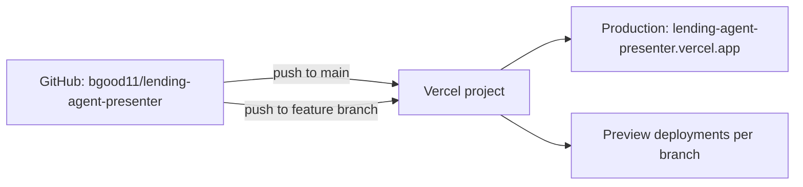

The demo deploys to Vercel from GitHub. Every push to `main` ships a production build; every push to a branch ships a preview build. This page walks the link-up.

## Project structure

The repo at `bgood11/lending-agent-presenter` is a single Next.js 16 App Router project. There is no monorepo configuration to wrestle with. The build is `next build`, the output is the default `.next` directory, the runtime is Node.



## Linking the repo

```bash
# In the repo root
pnpm dlx vercel link
```

Walks through:

1. Vercel scope (personal or team).
2. Project name (default: `lending-agent-presenter`).
3. Confirms detection of Next.js and the `pnpm` package manager.

Writes `.vercel/` to the repo root. `.vercel/` is gitignored; the repo's link to Vercel lives in your local checkout.

The first deploy:

```bash
pnpm dlx vercel
```

Builds and uploads. Returns a preview URL.

The first production deploy:

```bash
pnpm dlx vercel --prod
```

After this, GitHub auto-deploy takes over.

## GitHub auto-deploy

Once the project is linked to a GitHub repo, Vercel watches the repo:

| Trigger | Outcome |
|---|---|
| Push to `main` | Production deploy. URL is the project's primary domain. |
| Push to any other branch | Preview deploy. URL is `<project>-<hash>-<scope>.vercel.app`. |
| Pull request opened or updated | Preview deploy + comment on the PR with the URL. |
| Push to a tagged release branch | Production deploy if the tag is configured as a deploy target. Default off. |

Preview URLs persist for the lifetime of the deployment. They are unguessable but public.

## Environment variables (Vercel UI)

Open the project in the Vercel dashboard. Settings > Environment Variables. Three scopes:

| Scope | Available in | Use for |
|---|---|---|
| Production | Production deploys only | Real signing keys, real Postmark token, production database URL |
| Preview | Preview deploys (PRs and branches) | Staging signing keys, staging Postmark token, staging database URL |
| Development | `vercel env pull` to local `.env.local` | Mirrors production for local debugging when needed |

Add the variables from the [local development env-var table](/deploy/local/#environment-variables). Mark every secret as encrypted (the default).

`NEXT_PUBLIC_*` variables are exposed to the browser; do not use them for secrets. The signing keys, the database URL, the Postmark token, the webhook secret are all server-only.

### Pulling envs locally

```bash
pnpm dlx vercel env pull .env.local
```

Pulls the development-scope envs into `.env.local`. Use sparingly: prefer to keep production secrets out of dev machines unless debugging a production issue against a staging copy.

## Preview vs production

| Concern | Preview | Production |
|---|---|---|
| URL | `<project>-<hash>-<scope>.vercel.app` | Project's primary domain |
| Env scope | Preview | Production |
| Magic-link signing keys | Staging keys | Production keys |
| Database | Staging Postgres (separate URL) | Production Postgres |
| Email send | Postmark sandbox or muted | Postmark live |
| Real customer data | Forbidden | Permitted |

Treat the preview environment as if it were production for security purposes. URLs are unguessable but public; never push real customer data to a preview build.

## Build settings

Override only if needed. Defaults:

| Setting | Default |
|---|---|
| Framework preset | Next.js |
| Build command | `next build` |
| Output directory | `.next` |
| Install command | `pnpm install --frozen-lockfile` |
| Node.js version | 22.x |
| Region | London (`lhr1`) recommended for UK customers |

If the package manager is not auto-detected, set `pnpm install --frozen-lockfile` manually under Settings > General > Build & Development Settings.

## Custom regions

Vercel deploys to all regions by default for the static frontend. Route handlers (the API surface in production) should be pinned to London (`lhr1`) for UK GDPR data-residency:

```typescript
// app/api/quote/route.ts
export const runtime = "nodejs";
export const preferredRegion = "lhr1";
```

The KV and Postgres instances should also be UK-hosted. See [production hardening](/deploy/production-hardening/) for the full data-residency checklist.

## CI checks

The build runs on every push. Add CI checks separately if needed (GitHub Actions for type-checks, linting, tests). Vercel's build does not run a type-check by default; `next build` will fail on TS errors that surface during compilation but does not run `tsc --noEmit` on its own.

A minimal GitHub Actions workflow:

```yaml
name: ci
on: [push, pull_request]
jobs:
  type-check:
    runs-on: ubuntu-latest
    steps:
      - uses: actions/checkout@v4
      - uses: pnpm/action-setup@v4
        with: { version: 10 }
      - uses: actions/setup-node@v4
        with: { node-version: 22, cache: 'pnpm' }
      - run: pnpm install --frozen-lockfile
      - run: pnpm tsc --noEmit
      - run: pnpm lint
```

## Promoting a preview to production

Two ways:

1. Merge the PR into `main`. The next push to `main` deploys.
2. From the Vercel dashboard, find the preview deployment and click "Promote to Production". This is the rollback flow as well.

## Rollback

In the Vercel dashboard, Deployments > select a previous successful production deployment > Promote to Production. The DNS flips within seconds; no rebuild required.
