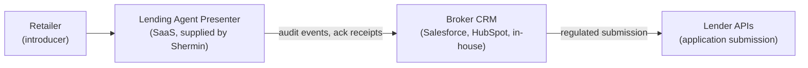

This page is for an FCA-authorised credit broker whose retailers want a presentment surface. The broker is the regulated entity. Lending Agent Presenter is the SaaS the broker uses to give its retailers a CONC 4.2-defensible quote presentation experience.

## Where it fits in the broker stack

The broker holds the FCA credit-broking permission. The retailer is an introducer (CONC 5.5: introducer arrangements) or, if the retailer holds its own broking permission, a sub-broker. Lending Agent Presenter is a tool the broker provides as part of the retailer onboarding kit.

## What slots in where

| Concern | Owned by | Notes |
|---|---|---|
| FCA credit-broking permission | Broker | Required. CCA-regulated activity. |
| Customer-facing acknowledgement | Lending Agent Presenter | CONC 4.2 disclosures, captured per quote. |
| Quote audit log | Lending Agent Presenter | Append-only, exportable to broker CRM. See [audit integration](/implementation/brokers/audit-integration/). |
| Application submission to lender | Broker | Out of scope for Lending Agent Presenter v1. |
| Customer credit decision | Lender | Out of scope. |
| Vulnerability flagging | Lending Agent Presenter (signal) + Broker (decision) | See [vulnerability process](/implementation/brokers/vulnerability-process/). |
| Customer data retention | Broker | Lending Agent Presenter retains for 7 years per SYSC 9 by default; broker controls retention policy. |
| Customer complaints | Broker | DISP-compliant complaints handling stays with the broker. Lending Agent Presenter surfaces complaint markers in the audit log. |

## Five-step adoption

| Step | Output | Typical duration |
|---|---|---|
| 1. Permissions confirmation | Permission scope reviewed against CONC 5.5 introducer or 5.2 broker model | 1 week |
| 2. Lender panel mapping | Catalogue per retailer reflects broker's contracted lender panel | 2 weeks (in parallel with retailer onboarding) |
| 3. Audit log shape | Broker CRM ingests audit events via webhook or batched export | 1-2 weeks |
| 4. Vulnerability process integration | Broker's existing flag-for-review process accepts Lending Agent Presenter signals | 1 week |
| 5. Pilot per retailer | One retailer goes live; broker observes the audit trail | 4 weeks |

End-to-end: 6-9 weeks before the first retailer goes live, then 4-week pilots per retailer thereafter.

### 1. Permissions confirmation

Two questions:

1. Does the broker hold the FCA permission for the activity it is now offering through Lending Agent Presenter? The activity is **credit broking** (Article 36A RAO). Most brokers reading this hold it.
2. Is the retailer an introducer (CONC 5.5) or a broker in its own right? If the retailer signs the contract directly with the lender, it is broking; otherwise, introducer. This determines the contract triangle.

The output of step 1 is a one-page memo from the broker's compliance function confirming permissions and introducer model. Shermin retains a copy.

### 2. Lender panel mapping

The broker provides Shermin with the full contracted lender panel: lender name, products, APRs, terms, deferred-payment specifics, minimum deposits, retailer-specific overrides. See [catalogue onboarding](/implementation/retailers/catalogue-onboarding/) for the per-product shape.

If a retailer in the pilot has a sub-set of the broker's panel (e.g. one lender pulled their solar BNPL product for that retailer's category), the catalogue captures that.

### 3. Audit log shape

The broker's CRM is the system of record for the customer relationship. Lending Agent Presenter's audit log is the system of record for the disclosure event itself. The two need to talk.

Two integration patterns:

| Pattern | Use when | Mechanism |
|---|---|---|
| Webhook | Broker CRM accepts inbound webhooks (most modern CRMs) | `audit-event` webhook fires per event. See [audit integration](/implementation/brokers/audit-integration/) for payload. |
| Batched export | Broker CRM is older or webhook-averse | Nightly CSV export of all events for the broker's retailers, posted to SFTP or downloaded from the admin portal. |

The webhook pattern is preferred. It's near real-time and fits the audit-as-evidence story.

### 4. Vulnerability process integration

The broker's CRM has a flag-for-review queue. Lending Agent Presenter surfaces vulnerability signals (extended interactions with the budget calculator, repeated tickbox toggling, request to talk to someone) and emits them as audit events. The broker's CRM picks them up and routes to the existing vulnerability team.

See [vulnerability process](/implementation/brokers/vulnerability-process/) for the signal taxonomy and the planned "flag for review" UX.

### 5. Pilot per retailer

The retailer pilot is described in the [retailer pilot playbook](/implementation/retailers/pilot-playbook/). The broker's role during pilot is to:

- Read the audit logs end-of-day for the first week.
- Verify the disclosure copy matches their compliance sign-off.
- Confirm the introducer model is being adhered to (no "rep selling finance off-script").
- Sign off the rollout decision jointly with the retailer and Shermin.

After pilot sign-off, the broker can onboard additional retailers in parallel using the same playbook.

## What changes in the broker's stack

| Surface | Change |
|---|---|
| Broker CRM | New webhook ingest for `audit-event`. New stage in pipeline: "quote acknowledged". New flag-for-review trigger on `vulnerability-signal`. |
| Broker compliance ops | New evidence source for SARs and DSARs (Lending Agent Presenter audit log). New retention map (7 years per quote, per SYSC 9). |
| Broker policies | Update introducer agreement template if introducer model is in use. |
| Broker reporting | Per-retailer KPIs feed into broker-level monthly compliance MI. |

What does not change: the lender submission pipeline, the credit decision process, the existing customer onboarding (KYC, AML, affordability) post-acknowledgement. Lending Agent Presenter handles disclosure and capture; it does not handle submission.
