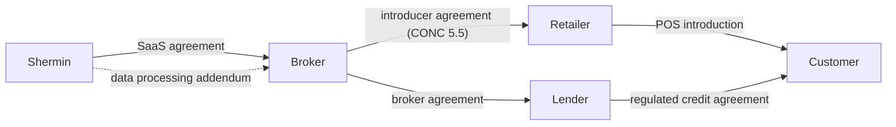

Lending Agent Presenter is SaaS tooling. The regulated activity sits with the broker (and, where relevant, the lender). This page specifies the FCA permissions needed, the CONC requirements the surface satisfies, and how contracts and liability are allocated across the four parties.

## Required FCA permissions

| Party | Permission | Source |
|---|---|---|
| Broker | Credit broking (Article 36A Regulated Activities Order 2001) | FSMA 2000 + RAO 2001 |
| Lender | Entering into regulated credit agreements as lender (Article 60B RAO) | FSMA + RAO |
| Retailer (if not introducer-only) | Credit broking, by appointment or in their own right | FSMA + RAO |
| Shermin | None (technology supplier, not regulated activity) | Out of FSMA perimeter |

Lending Agent Presenter does not perform any regulated activity. It captures disclosures and produces an audit trail. The act of broking (introducing, advising, arranging) is performed by the broker, mediated through the retailer's reps. The lender enters into the credit agreement with the customer.

## CONC requirements the surface satisfies

| Source | Requirement | How Lending Agent Presenter helps |
|---|---|---|
| CONC 4.2.5R | Adequate explanation of features of credit | Customer phone surface presents every contracted option side-by-side, with deposit, monthly, total payable, term, and a key-feature one-liner. The four-checkbox acknowledgement maps to the CONC 4.2 list. |
| CONC 4.2.5R(2) | Pre-contractual explanations | Captured before the customer is referred to a lender. Audit event records the pre-contractual presentation. |
| CONC 4.2.10R | Adequate explanation in respect of overpayment, term, total payable | Customer-phone PDF preview surfaces these. Acknowledgement checkboxes capture them. |
| CONC 3.5 | Financial promotions | Footer carries broker-status disclosure, FCA register number, and lender attribution per product. |
| CONC 5.5 | Introducer-led broking | Retailer's introducer status is recorded in the retailer row; surface footer reflects the introducer disclosure where applicable. |
| CONC 7.10 | Treating customers in financial difficulty fairly | Out of scope for Lending Agent Presenter. Sits with the broker and lender post-acknowledgement. |
| Consumer Duty (PRIN 12) | Good outcomes across products, price, value, consumer understanding, support | Surface design (every option, every customer, every time) is the consumer-understanding lever. The audit trail evidences the design choice. |

The four customer-phone acknowledgements are CONC 4.2 verbatim:

1. **Minimum repayment.** "I understand I must make at least the minimum monthly payment shown."
2. **Can overpay.** "I understand I can pay more than the minimum at any time without penalty."
3. **Contact lender.** "I understand I should contact the lender to apply overpayments to clear the balance early."
4. **Credit agreement.** "I understand this is a credit agreement and I will be subject to its terms."

## Contract triangle

There is no direct contract between Shermin and the lender, the customer, or the retailer (in the typical model). Shermin contracts with the broker; the broker passes the surface to the retailer under their introducer agreement.

## Contracts in scope

### Shermin to Broker: SaaS agreement + DPA

The headline document. Covers:

| Section | Content |
|---|---|
| Service definition | Lending Agent Presenter rep, customer, and admin surfaces. Audit log retention 7 years. Webhook integration optional. |
| Pricing | Per-quote tiered fee. Pilot fee for first 4 weeks. |
| SLA | 99.9% uptime, p95 page load < 2s, 24-hour support response. |
| Data processing | Shermin is processor, broker is controller. UK GDPR Article 28. UK SCCs in place for any sub-processors outside the UK. |
| Sub-processors | Vercel (hosting), Postmark or SES (email), Vercel KV / Postgres, Vercel Blob (PDF storage). Updated list in the data processing addendum. |
| Security | ISO 27001-aligned controls, annual penetration test, encryption in transit and at rest. |
| Audit rights | Broker may audit Shermin once per year, with 30 days' notice. |
| Liability cap | 12 months of fees, with carve-outs for data breach (UK GDPR Article 82) and IP infringement. |
| Termination | 90 days' notice. Data export within 30 days of termination. Acknowledged-quote audit log retained per regulatory retention obligation. |

### Broker to Retailer: introducer agreement (CONC 5.5)

Broker drafts. Lending Agent Presenter is named as a tool provided by the broker. Specific clauses to add:

- Retailer's reps will only describe finance options using the rep tablet's pre-contracted catalogue.
- Reps will not provide advice or recommend specific products beyond the rep tablet's neutral presentation.
- The retailer will keep its branding pack (logo, footer text, FCA register number) up to date with Shermin via the broker.
- The retailer indemnifies the broker for any deviation from the introducer model by its reps.

### Broker to Lender: broker agreement

Standard. Existing brokers will already have these. Lending Agent Presenter does not require modification beyond confirming the audit trail format meets the lender's evidence standard.

### Customer to Lender: credit agreement

Out of scope for Lending Agent Presenter. The agreement is signed via the lender's existing onboarding (post-acknowledgement). Lending Agent Presenter records that the customer acknowledged the CONC 4.2 disclosures before the credit agreement was offered.

## Liability allocation

| Risk | Bearer | Notes |
|---|---|---|
| FCA enforcement against broker for unfair customer treatment | Broker | Lending Agent Presenter audit log is admissible evidence in the broker's defence. |
| FCA enforcement against retailer for off-script broking | Retailer | Indemnified up the chain only via the broker-retailer agreement, not by Shermin. |
| Data breach in Lending Agent Presenter infrastructure | Shermin (processor) | Broker remains controller. Notification chain: Shermin → broker → ICO + customers per UK GDPR. Liability cap per SaaS agreement + statutory rights. |
| Customer dispute about disclosure | Broker | Lending Agent Presenter audit log shows what was presented. Final accountability for disclosure rests with the broker. |
| Lender pulling a product mid-quote | Broker | Catalogue updates within 24 hours. In-flight quotes referencing retired products are reissued. |

## What Lending Agent Presenter does not promise

- Does not guarantee FCA compliance. The broker's compliance team owns this.
- Does not perform credit decisioning or affordability assessment.
- Does not submit applications to lenders.
- Does not handle complaints (DISP). Complaints surface in the audit log; the broker handles them.
- Does not advise. The surface presents every option neutrally; the rep does not recommend one over another in the surface.
