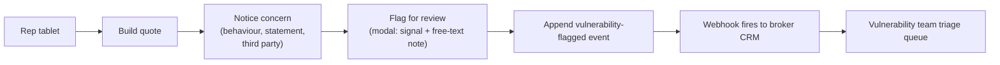

The FCA's Consumer Duty (PRIN 12) and the FG21/1 vulnerability guidance ask firms to identify and respond to vulnerable customers. Lending Agent Presenter does not make vulnerability decisions; it surfaces signals, captures them in the audit log, and routes them to the broker's existing review process.

## Design intent

Two surface design choices are deliberately vulnerability-aware:

1. **Option-comparison grid.** Every contracted option side by side. The customer is never shown a "recommended" option in a way that pressures them to pick it. The rep can mark a soft preference, but the visual cue is suggestive, not coercive. A vulnerable customer is not pushed by ranking, only informed by clarity.
2. **Budget calculator.** A target-monthly slider that re-sorts options and disables those that cannot meet the target. A customer with cashflow anxiety can verify their monthly limit is achievable across the options, in their own time, on their own device.

These choices help vulnerability outcomes whether or not anyone has flagged the customer. They are baseline-fair-to-everyone design.

## Indicator taxonomy

The surface emits four kinds of vulnerability signals as audit events. They are not diagnoses; they are markers for the broker's vulnerability team to triage.

| Signal | Trigger | Notes |
|---|---|---|
| `repeat-tickbox-toggle` | Customer toggles the same acknowledgement checkbox more than three times | May indicate confusion or coercion (e.g. a third party reading over their shoulder) |
| `extended-budget-session` | Customer spends more than 8 minutes in the budget calculator | May indicate cashflow anxiety or affordability concerns |
| `repeated-pick-change` | Customer changes their picked option more than four times | May indicate indecision or pressure |
| `request-to-talk` | Customer taps the "Talk to someone" button (planned, not in demo v1) | Direct request for human contact |

Each signal emits a `vulnerability-flagged` audit event:

```typescript
{
  type: "vulnerability-flagged",
  by: "system",
  description: "Customer toggled an acknowledgement tickbox 5 times",
  detail: {
    signal: "repeat-tickbox-toggle",
    box: "creditAgreement",
    count: 5
  }
}
```

The signal name is enum-typed so the broker's CRM can filter and route deterministically.

## Rep-side flag

The rep can flag a quote during or after building it. The rep tablet (planned, not in demo v1) carries a small "flag for review" affordance:



The flag carries:

- The rep's free-text note (capped at 500 characters, no PII guidance reminder).
- A signal enum: `customer-distress`, `third-party-pressure`, `language-barrier`, `cognitive-difficulty`, `other`.
- The rep's name and timestamp.

Flagging does not block the quote. The customer still receives the magic link. The flag is a parallel signal to the broker's review queue, not a hold on the journey. This is deliberate; FG21/1 calls for inclusive design that does not exclude flagged customers from the same service offered to everyone else.

## Admin-side flag

An admin reviewing a quote in the admin portal can flag it after the fact. The audit event is the same shape; `by` is `rep` (the admin acts in a rep-equivalent capacity for the audit log) and the detail bag carries `flaggedFromAdmin: true`.

## Customer-side request to talk

The customer phone surface (planned, not in demo v1) carries a small "Talk to someone" link in the footer. Tapping it:

1. Renders a "your retailer will contact you within X working hours" page (X is configurable per retailer; default 1 working day).
2. Emits `vulnerability-flagged` with `signal: "request-to-talk"`.
3. The retailer's vulnerability process picks it up via the standard webhook path.

This affordance is not a substitute for the broker's vulnerable-customer policy. It is a signal channel that connects the customer to the existing human process the broker already runs.

## What the surface deliberately does not do

| Decision | Reason |
|---|---|
| Score customers as "vulnerable" | Vulnerability is contextual and not amenable to algorithmic scoring. The signals are markers for human review, not classifications. |
| Block a flagged customer from acknowledging | Exclusion is not the right outcome. The flag triggers human follow-up, not a barrier. |
| Share signals with lenders | Out of scope. Signals are between Shermin (processor), broker (controller), and retailer (introducer). Lender disclosure follows the broker's existing vulnerable-customer process. |
| Use ML or pattern detection on signals | The signals are deterministic and rule-based. Adding ML adds explainability burden under Consumer Duty without obvious benefit. |

## Integration with broker's existing process

Most brokers reading this already have:

- A vulnerability lead and team.
- A flagging queue in their CRM.
- A documented script for vulnerable-customer follow-up.
- Training records for staff who handle flagged customers.

Lending Agent Presenter integrates by:

1. Routing `vulnerability-flagged` events through the same webhook as other audit events. The CRM filters on event type and routes to the vulnerability queue.
2. Surfacing a "flagged" badge on the admin portal quote list and the quote detail view.
3. Including a "vulnerability signals" section in the audit timeline on the quote detail page.

The broker's vulnerability team picks up flagged quotes from the queue, follows their script, and (separately) records their action in the CRM. Lending Agent Presenter does not record the broker's response; the broker's CRM does.

## Reporting and MI

The admin portal's dashboard (planned) carries a vulnerability tile:

| KPI | Definition |
|---|---|
| Quotes flagged this month | Count of unique quote IDs with at least one `vulnerability-flagged` event |
| Flag-to-acknowledged rate | % of flagged quotes that ultimately acknowledge |
| Top signal | Most frequent signal enum this month |
| Flagged-quote response time | Median time from flag event to broker CRM action (requires CRM webhook back) |

The MI is for the broker's compliance reporting and Consumer Duty board pack. It is not customer-facing.
