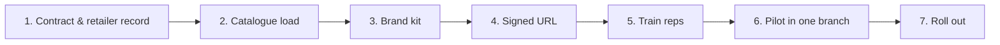

This page is for an FCA-authorised retailer (or a credit broker contracting on behalf of one) bringing Lending Agent Presenter into a single fascia. The path assumes a typical two-to-five-branch retailer; multi-brand groups telescope each step.

## Seven steps



| Step | Owner | Typical duration | Output |
|---|---|---|---|
| 1. Contract and retailer record | Shermin + retailer | 1 week | Retailer row in production database, contract signed |
| 2. Load catalogue | Retailer + lender contacts | 1-2 weeks | Per-product rows for every contracted finance option |
| 3. Brand kit | Retailer marketing | 3-5 days | Logo SVG, brand primary hex, footer text |
| 4. Shape signed URL | Shermin | 1 day | Signed retailer URL provisioned and tested |
| 5. Train reps | Retailer ops | 1 day per branch | Reps know the surface and the script |
| 6. Pilot in one branch | Retailer + Shermin | 4 weeks | Acknowledgement-rate baseline, rep feedback |
| 7. Roll out | Retailer ops | 1-2 weeks | All branches live |

End-to-end: 8 to 11 weeks for a typical retailer. A retailer with a tightly defined catalogue and a single branch can compress this to 4-5 weeks.

## 1. Contract and retailer record

Two things happen in parallel: the commercial contract gets signed, and the retailer record gets created.

The commercial contract specifies:

- Per-quote SaaS fee (tiered by volume).
- Pilot duration (default 4 weeks, see [pilot playbook](/implementation/retailers/pilot-playbook/)).
- Data processing terms (UK GDPR, retention, sub-processors). See [permissions and contracts](/implementation/brokers/permissions-contracts/) for the full liability allocation.
- Termination terms. The retailer can request data export and full deletion within 30 days of termination, subject to FCA seven-year retention on acknowledged quotes.

The retailer record is a single `retailers` row:

```typescript
interface Retailer {
  id: string;
  legalName: string;
  shortName: string;
  fcaRegisterNumber: string;
  footerText: string;
  contractTier: "pilot" | "active" | "suspended";
  skinId: SkinId;
  createdAt: string;
}
```

Shermin creates the row. The retailer signs off on the displayed footer text and FCA register number before any quotes can be issued.

## 2. Load catalogue

The retailer provides every contracted finance product with their lender panel. See [catalogue onboarding](/implementation/retailers/catalogue-onboarding/) for the exact form and the data shape. Output is a populated `finance_products` table for the retailer.

This is the longest step. Lender lookup tables (APR by term, deferred-payment specifics, minimum deposit floors) often live in PDFs and need to be transcribed and verified.

## 3. Brand kit

The retailer's marketing team supplies:

- Logo SVG (single tone, `currentColor`, viewBox-clean). See [branding](/implementation/retailers/branding/) for full requirements.
- Brand primary hex (one colour; amber stays as the secondary accent).
- Footer text (the FCA broker disclosure, signed off by compliance).

Shermin uploads to `brand_kits`. A staging URL is shared with the retailer for sign-off.

## 4. Shape signed URL

Each retailer gets one signed URL of the form:

```
https://app.example.com/r/<retailerId>?sig=<HMAC>
```

The signature is HMAC-SHA256 over `retailerId + epoch-day`. Re-signed nightly to allow key rotation without breaking in-store devices for too long. The URL is bookmarked on every rep tablet and serves as the authentication seam: anyone with the URL is treated as an authorised rep, and rep-name capture handles per-quote attribution.

There is no per-rep login. This is deliberate. The cost of authenticating reps individually outweighs the marginal audit value when the URL is on a managed in-store device.

## 5. Train reps

A 30-minute walk-through per branch:

1. Open the signed URL on the in-store tablet, type their name once, accept "save this device".
2. Build a quote with a real customer scenario from the day before.
3. Send to the customer and watch the magic link arrive on a personal phone.
4. Watch the customer surface, pick an option, tick the boxes, confirm.
5. Open the admin portal on a back-office laptop and find the quote.
6. Look at the audit timeline and recognise every event.

Reps do not need any compliance training to use the surface. The acknowledgements are CONC 4.2 verbatim and the system handles the audit trail.

## 6. Pilot in one branch

Four weeks. See [pilot playbook](/implementation/retailers/pilot-playbook/) for the week-by-week template. Success metrics are acknowledgement rate (target: 70%+), quote-to-acknowledged conversion (target: 50%+), and rep adoption (target: every rep issues at least three quotes/week).

## 7. Roll out

After pilot sign-off, additional branches come online in waves of one to three per week. Each branch gets the same signed URL bookmarked on its tablets. There is no per-branch configuration; branches are not modelled in the data layer for v1.

Multi-fascia retailers (one parent, multiple trading names) require one `retailers` row per fascia and a separate signed URL per fascia. The `retailers` row carries the fascia's own FCA register number and footer text.
