A pilot tests one branch for four weeks before broader rollout. The goals are: prove acknowledgement rate, surface UX rough edges, and give reps confidence before they roll the surface to a customer with real signing pressure on the deal. This page is the week-by-week template.

## Prerequisites

Before week 1 begins:

- Steps 1-5 of the [adoption path](/implementation/retailers/adoption-path/) are complete.
- One branch is nominated. Choose a branch with: a manager who is comfortable with new tooling, two to four reps, and ten or more quote opportunities a week.
- Retailer signs off on the pilot success metrics (below).
- Shermin and the retailer ops lead share a Slack or Teams channel for the duration.

## Four-week structure

```mermaid
gantt
  title Pilot structure
  dateFormat  X
  axisFormat %s
  section Week 1
  Install + train         :a1, 0, 7
  section Week 2
  Monitor + adjust copy   :a2, 7, 7
  section Week 3
  Expand to second branch :a3, 14, 7
  section Week 4
  Review + decide rollout :a4, 21, 7
```

### Week 1: install and train

| Day | Activity |
|---|---|
| Mon | Tablets bookmarked with signed retailer URL. Brand kit smoke-tested on each device. |
| Tue | Rep training session, 30 minutes per rep. See [adoption path](/implementation/retailers/adoption-path/) step 5. |
| Wed | Branch goes live. Reps start using the surface for live customers. |
| Thu | Shermin observes branch ops on the back-office laptop and the admin portal. Notes any rep friction. |
| Fri | First retro: 15-minute call with the branch manager. What was confusing, what landed well, anything missing. |

Volume target: 10-15 quotes by end of week. Acknowledgement rate is not measured yet; the focus is purely "did the surface work end-to-end".

### Week 2: monitor and adjust copy

| Activity | Notes |
|---|---|
| Daily volume check | Quotes/day, sent vs acknowledged ratio. |
| Copy tweaks | Adjust footer disclosure, key-feature one-liners, customer-phone microcopy if reps or customers flag confusion. |
| Customer interviews | Shermin or retailer CX calls 3-5 acknowledged customers. 10-minute scripted interview: did the link arrive, did the page load, were the options clear, did anything feel off. |

Output of week 2 is a small list of copy changes plus a note on any structural issues. Structural issues (missing product type, broken brand) trigger a hold on rollout.

### Week 3: expand to second branch

| Day | Activity |
|---|---|
| Mon | Train second branch reps. Same 30-minute drill. |
| Tue-Fri | Both branches live. Compare metrics across the two. |

Two branches at once tests whether the rollout playbook scales without hand-holding. The second branch should hit week-1 milestones without Shermin onsite.

### Week 4: review and decide

| Activity |
|---|
| Pull the four success metrics for the full pilot period. |
| Branch managers share a written reflection: what worked, what blocked them, what they would change. |
| Customer interviews: another batch of 5-10. |
| Joint review meeting. Decide: roll out, extend pilot by 2 weeks, or pull back. |

## Success metrics

| Metric | Target | How measured |
|---|---|---|
| Acknowledgement rate | 70%+ | `acknowledged` quotes / total quotes (excluding `expired`) |
| Quote-to-acknowledged conversion | 50%+ | `acknowledged` quotes / `sent` quotes (i.e. the link arrived) |
| Rep adoption | Every rep ≥ 3 quotes/week | Distinct reps in `quotes` table per week |
| Customer satisfaction | 4/5+ | Single question in the customer email after acknowledgement |
| Time-to-acknowledgement | Median < 24 hours | `acknowledged_at - sent_at` median |

Acknowledgement rate is the headline. A retailer below 50% is not getting compliance value out of the surface and the pilot has failed. Diagnostics in that scenario:

- Are customers receiving the email? Check Postmark delivery logs.
- Is the customer phone view confusing? Customer interviews surface this.
- Are reps using "in-store ack now" as the default? That is the fallback, not the default; if usage is high, retraining is needed.

## Rollout decision matrix

| Outcome | Action |
|---|---|
| All five metrics hit, no structural issues | Roll out to remaining branches in waves of one to three per week. |
| Acknowledgement rate above 50% but below 70%, no structural issues | Extend pilot by 2 weeks. Run copy tweaks and customer interviews. |
| Acknowledgement rate below 50% | Pause. Diagnose root cause. Potentially reshape the surface or the catalogue. |
| Rep adoption below target but acknowledgement rate is high | Roll out, with an expanded training session for the next branch. |
| Customer satisfaction below 4/5 | Pause rollout. Investigate. Customer-facing changes are higher-cost than rep-facing changes. |

## What does not count as pilot failure

- One or two reps prefer the old way. Roll out with their managers' support.
- A small number of customers don't open the link. The 70% acknowledgement rate target is set with this in mind.
- The retailer's contracted lender panel changes mid-pilot. Pause briefly, refresh the catalogue, resume.

## What does count as pilot failure

- A bug in finance maths, even a small one. Stop, fix, restart pilot from week 1.
- Customer complaints about pressure or unclear disclosure. Stop, investigate, restart.
- Rep insistence that the surface is unusable, after retraining. The rep tablet UX is the most invested-in surface; if it does not land, the product needs reshaping, not rolling out.
