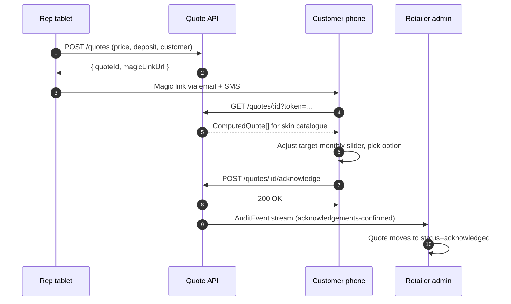

The journey runs in three steps and four surfaces. The rep builds a quote, the customer acknowledges on their own device, and the retailer admin captures the audit trail.

## Step 1, rep tablet

The rep opens a signed retailer URL on a tablet, captures their name once into localStorage, and lands on the quote builder. Description, price, deposit percent, and the customer's name, email, and mobile go in the left pane. The right pane renders every product in the skin's catalogue as a live card: deposit £, monthly, total payable, term, key feature one-liner. Highlight badges call out the lowest monthly, lowest total cost, and shortest term.

The rep clicks "Send to customer's phone". In production this fires an email and SMS containing a signed magic link. In the demo it crossfades to the customer surface with the in-flight quote already in state.

The in-store fallback ("Customer present, ack now") is for situations where the customer has no phone available. It hands the tablet to the customer in place of the magic link.

## Step 2, customer phone

The customer opens the link on their phone. The header shows the retailer brand and the rep's name. The quote summary card shows total and deposit. Below it, the option comparison grid lets the customer tap to expand any product. The budget calculator is a target-monthly slider: as it moves, products re-sort and ones unreachable at that target grey out.

Below the comparison, an accordion previews the styled HTML mock of the SECCI and pre-contract pack. Beneath that, the four key-feature acknowledgements:

- Must make the minimum monthly repayment.
- Can overpay at any time.
- Must contact the lender to apply overpayments to the term or the balance.
- Understands this is a regulated credit agreement.

These four are the CONC 4.2 adequate-explanation hooks. The confirm button is disabled until all four boxes are ticked and one option is picked.

## Step 3, retailer audit

On confirm, the demo crossfades to the retailer admin portal with the new quote highlighted at the top of the list. Drilling into the quote detail surfaces the full event timeline: `quote-created`, `quote-sent`, `magic-link-clicked`, `option-picked`, `acknowledgements-confirmed`. Each event has an ISO timestamp, an actor (`rep`, `customer`, or `system`), a description, and optional structured detail.

## Sequence

In v1 demo, all of this is in-process state. The shapes match what the planned API will return so the surfaces map cleanly onto the production build.

## In-store fallback

If the customer has no phone available, the rep selects "Customer present, ack now" on the tablet. The same comparison and acknowledgement flow runs on the rep's tablet. The audit trail records the same four acknowledgements with `in_store_fallback=true` so the retailer can reconcile against the magic-link path.
