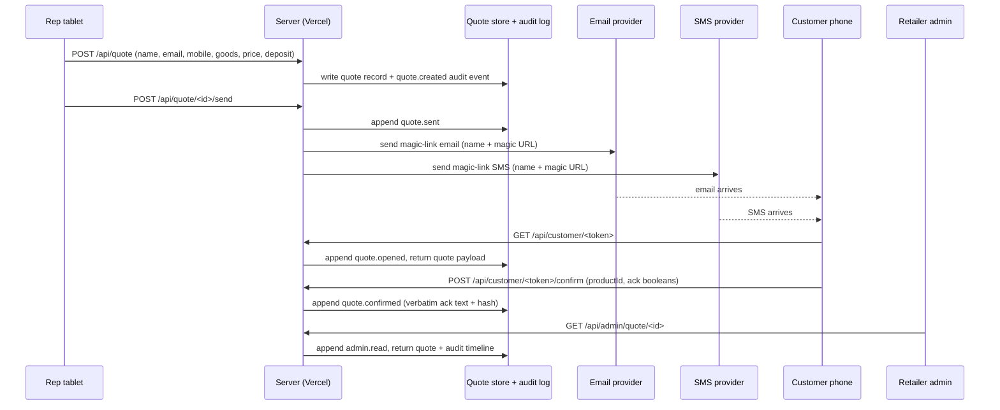

This page traces every personal-data field from the moment the rep types it on the tablet through the audit log that the retailer reviews afterwards. The flow is short. There are three external sub-processors (email, SMS, store) and one customer device. There is no third-party analytics, no marketing pixel, no profiling endpoint.

## High-level sequence

Two paths leave the server boundary: the email provider edge and the SMS provider edge, both for magic-link delivery. No other path leaves the server with personal data attached. The lender hand-off is not in this diagram because it is out of scope for Presenter; the customer clicks through from the confirmed Presenter receipt to the lender's own application surface, and the lender collects identity, address, income, and credit-search consent from there.

## Field-by-field inventory

### From the rep tablet to the server

When the rep clicks "Send to customer", the tablet posts a quote payload to `/api/quote`. The payload is small.

**Personal data:** customer name, customer email, customer mobile, claimed rep name (from localStorage). The goods description is not personal data per se, but it is recorded alongside.

**Where it lives on the server:** validated by Zod schema, written to the quote record in the store, hashed (SHA-256 of the canonical JSON) and the hash recorded in a `quote.created` audit event.

**What flows to sub-processors at this stage:** nothing. The quote-create call writes to the store only. Magic-link delivery is a separate `/send` call.

### Magic-link delivery to the customer

The `/send` endpoint generates a magic-link token (HMAC-SHA256, see [tampering and replay](../safety/tampering-and-replay/) for the format), issues an email via the email provider, and issues an SMS via the SMS provider. Both providers receive the customer's full email address and full mobile number respectively, and both receive the customer name and the magic-link URL in the message body.

**To the email provider (e.g. Postmark, AWS SES):** customer name, customer email, magic-link URL, retailer skin name. Provider retention is governed by the provider's standard logs; for Postmark this is 45 days for full message content and longer for hashed metadata. Detail in [sub-processors](sub-processors/).

**To the SMS provider (e.g. Twilio, MessageBird):** customer name, customer mobile, magic-link URL. Provider retention varies; Twilio retains message content for 13 months by default and offers a redaction setting that drops message bodies after 30 days. The deploy guidance enables redaction for production.

The magic-link URL itself does not contain personal data. The token is opaque (a base64url HMAC over `quoteId`, `expiry`, `nonce`). A leaked token discloses one quote, not a customer's name or contact details.

### Customer surface to the server

The customer opens the magic link on their phone. The token is verified server-side; a `quote.opened` audit event is appended with the IP and user-agent. The server returns the quote payload (including the customer name and the goods description) to the page.

The customer interacts with the page (option-pick, budget-calculator slider, acknowledgement checkboxes). None of those interactions hit the server until "Confirm" is clicked. The page is rendered server-side initially and runs client-side from there; no telemetry leaves the page during the interaction.

**On confirm:** the page posts `productId` and the four acknowledgement booleans to `/api/customer/<token>/confirm`. The server validates, writes the acknowledgement to the quote record, appends a `quote.confirmed` audit event with the verbatim text of the four statements as shown, and returns success.

### Retailer admin to the server

The retailer's admin staff log into the admin portal (production: behind retailer SSO; demo: open). They read the dashboard, list, and detail pages. Each page hits server endpoints that read the quote store and the audit log, append `admin.read` events with the session ID, and return the data.

**Personal data on these pages:** customer name and contact details on the list and detail views. The dashboard KPI tiles do not show PII.

**No write paths.** The admin portal does not edit quotes or audit events.

## Storage tiers

| Tier | Lifetime | Examples |
|---|---|---|
| Browser localStorage (rep) | Per device | Rep name string only |
| Browser localStorage (customer) | None | Demo state for the explore mode; no production use |
| Vercel server memory | Per request | All in-flight payloads |
| Quote store | 7 years (confirmed) / 28 days (unconfirmed PII) | Quote records, including PII |
| Audit log | 7 years | All `quote.*` and `admin.*` events |
| Email provider logs | Provider default (Postmark 45d, SES configurable) | Email address + body |
| SMS provider logs | Provider default (Twilio 30d with redaction) | Mobile + body |
| S3 daily roll-up of audit log | 7 years (object lock, compliance mode) | Off-platform durable copy |

## What flows where, summarised

**To the email provider:** name, email, magic-link URL.

**To the SMS provider:** name, mobile, magic-link URL.

**To the data store:** every quote field, every acknowledgement, every audit event.

**To the customer:** their own quote, their own acknowledgement state, the four verbatim statements.

**To the retailer admin:** every quote and every audit event for that retailer's tenant.

**To the lender (out of band):** nothing automatic from Presenter. The customer is handed off via a confirmed Presenter receipt; the lender collects its own data from the customer in its own application surface.

**To Vercel platform logs:** request paths and response codes per Vercel's standard observability. Request bodies are not logged. The application code does not write personal data to `console.log`; structured server-side logs are scoped to event types and IDs only.

**To anywhere else:** nothing. There is no Google Analytics, Plausible, Segment, Mixpanel, Sentry breadcrumbs, or marketing pixel in the v1 customer surface. The marketing landing page is separately covered in [PECR and cookies](pecr-and-cookies/).

## A note on the in-store fallback

When the rep selects "Customer present, ack now", the customer phone surface is rendered in the same browser tab as the rep tablet (rather than reached via a magic link). No SMS or email is dispatched. The data flow shrinks: there is no email-provider edge and no SMS-provider edge for that quote. The audit-log entries are the same shape, with a flag `inStoreFallback: true` on the quote record so a later review can identify the channel.
