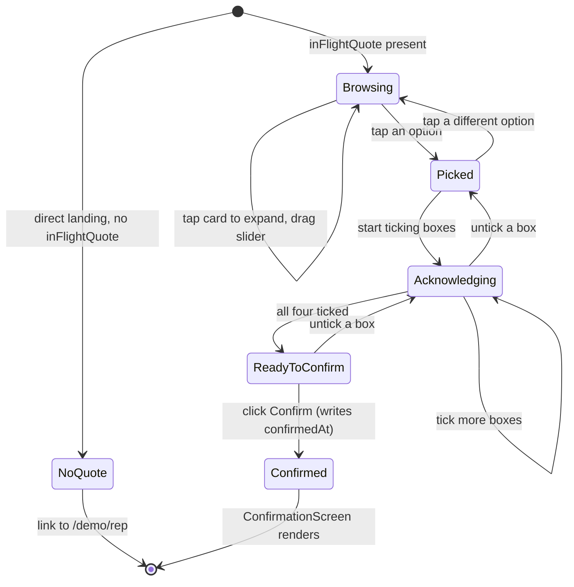

The customer phone surface renders at `/demo/customer/[token]`. In the v1 demo, `[token]` is the static string `demo-token`. In production it is a base64url HMAC-signed token resolving to a single quote.

## Layout

Phone-first (375 px to 414 px sweet spot). Wrapped in a `PhoneFrame` component on tablet and desktop so the surface always reads as a phone.

- **Header**. Retailer skin logo plus name plus "Sent by [Rep name]". Locked to the top.
- **Quote summary card** (`components/customer/quote-summary-card.tsx`). Headline price, deposit, "View all options" downward chevron.
- **Option comparison grid** (`components/customer/option-comparison-grid.tsx`). Vertical scroll of finance product cards. Tap to expand a card; tap again to collapse. Tap-to-pick sets `customerAck.pickedProductId`.
- **Budget calculator** (`components/customer/budget-calculator.tsx`). Slider with the rep's recommended monthly highlighted. As the slider moves, options re-sort and ones unreachable at that target visually disable.
- **PDF preview** (`components/customer/pdf-preview.tsx`). Accordion that expands a styled HTML mock of the SECCI and pre-contract pack for the picked option. Not a real PDF.
- **Acknowledgement checklist** (`components/customer/acknowledgement-checklist.tsx`). Four checkboxes; each is required.
- **Confirm** primary button. Disabled until one option is picked and all four checkboxes are ticked.

On confirm: the page renders `ConfirmationScreen` (`components/customer/confirmation-screen.tsx`) with a green tick and a "Open the retailer admin to see your quote" link.

## The four CONC 4.2 acknowledgements

Encoded in `CustomerAcknowledgement.acknowledgements`:

| Field | Customer-facing label |
|---|---|
| `minimumRepayment` | "I must make at least the minimum monthly repayment shown." |
| `canOverpay` | "I can overpay at any time without penalty." |
| `contactLender` | "To apply overpayments to the term or balance, I need to contact the lender directly." |
| `creditAgreement` | "I understand this is a regulated credit agreement." |

Wording is not skin-specific; broker compliance owns it. See [Regulatory, CONC 4.2](/regulatory/conc-4-2/).

## Budget calculator mechanics

The slider value is the customer's target monthly. For each non-cash product:

```typescript
import { depositForTargetMonthly, minMonthlyForProduct } from "@/lib/finance-math";

const reachable = targetMonthly >= minMonthlyForProduct(product, price);
const requiredDeposit = depositForTargetMonthly(product, price, targetMonthly);
```

`minMonthlyForProduct` returns the lowest monthly achievable at 95% deposit. If the customer's target is below that, the option is unreachable and visually disabled.

`depositForTargetMonthly` is a binary search over deposit percent that converges on the target monthly within £0.50 in around 25 iterations. It powers the "to hit £X / month, you would need to put £Y down" hint shown beside each option as the slider moves.

## Data in, data out

| Direction | Field | Source / sink |
|---|---|---|
| In | `inFlightQuote` | Zustand store, set by rep tablet |
| In | `skin` | Zustand store |
| In | `repName` | Zustand store |
| Out | `customerAck.pickedProductId` | tap on a finance product card |
| Out | `customerAck.targetMonthly` | drag the budget slider |
| Out | `customerAck.acknowledgements.*` | tick a checkbox |
| Out | `customerAck.confirmedAt` | click Confirm (ISO timestamp) |

In production, the **Confirm** click fires `POST /quotes/:id/acknowledge` with the four boolean flags, the picked option id, and the target monthly. See [Reference, API routes](/reference/api-routes/).

## State machine



## No-quote fallback

If a visitor lands on `/demo/customer/demo-token` directly without an in-flight quote in the Zustand store (e.g. fresh tab, no rep tablet history), the page renders a "No quote yet" panel with a link back to `/demo/rep`. The same page exists for the demo only; in production the route would resolve a real quote from the magic-link token.

## Screenshot anchors

- `customer-phone-default.png`: Solaris quote, fresh load
- `customer-phone-budget-slider.png`: slider dragged to £150/mo, options re-sorted
- `customer-phone-picked.png`: 60-month monthly option picked, acknowledgement checklist visible
- `customer-phone-confirmed.png`: confirmation screen
