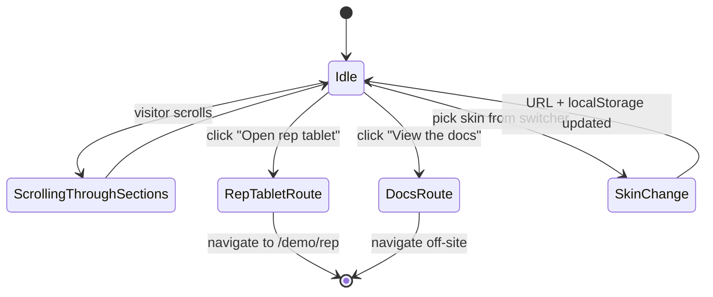

The marketing landing renders at `/`. It is the only public, unscripted entry point. Sections are laid out in a fixed vertical sequence and route into the demo at the foot of the page.

## Sections

1. **Hero**. Headline, subhead, primary CTA "Open the rep tablet", secondary CTA "View the docs". Beside the copy, an embedded interactive preview (`components/marketing/hero-preview.tsx`) shows the rep tablet at 0.7 scale with a looping micro-interaction: form auto-fills, options auto-highlight, send button pulses.
2. **How it works (3-step)**. Each step has an illustration accent, a short heading, and one paragraph of body. Mirrors the [Introduction / How it works](/introduction/how-it-works/) summary.
3. **Features grid**. Six tiles: Every option, every time / No rep auth / Magic-link customer ack / Audit trail / Retailer skinning / Target-payment calculator. Each tile is a Lucide icon plus title plus 30-word body.
4. **Compared to other competitor products**. Two-column comparison. Left: "How others do it" (per-rep auth, dense wizards, in-store handover). Right: "How Lending Agent Presenter does it" (open URL, one-page UI, async customer ack on the customer's device). No competitor names.
5. **Audience cards**. Two cards, one for retailers and one for brokers, each routing into the matching section of the docs.
6. **FAQ**. Five to seven items: is this regulated, who holds the FCA permission, how does the rep authenticate, what about customers without a phone, how is data retained, how is per-retailer skinning done.
7. **FCA-style footer**. Per-skin compliance text, links to all docs sections, sister-product link to Lending Agent.

## Key user actions

- Click "Open the rep tablet". Routes to `/demo/rep` and starts the scripted walkthrough at step 2.
- Click "View the docs". Routes to this site at `/introduction/what-it-is/`.
- Cycle the skin switcher in the top corner. The hero preview, footer, and all subsequent pages re-render against the chosen skin.

## Data flow

The landing page does no data fetching. The hero preview is purely client-side animation over hardcoded values. Skin selection is read from `?skin=` query param, falls back to localStorage, then to the Solaris default. See [Reference, Skin definition](/reference/skin-definition/).

## State machine

## Components

- `components/marketing/hero.tsx`: copy plus CTA layout
- `components/marketing/hero-preview.tsx`: embedded rep-tablet animation
- `components/marketing/how-it-works.tsx`: three-step explainer
- `components/marketing/features-grid.tsx`: six feature tiles
- `components/marketing/competitor-comparison.tsx`: two-column comparison
- `components/marketing/audience-cards.tsx`: retailer and broker cards
- `components/marketing/faq.tsx`: accordion FAQ
- `components/marketing/site-footer.tsx`: per-skin FCA footer

## Notes for the production build

- The hero CTA needs to issue a signed retailer URL when the page is hosted on a retailer's domain. In v1 demo it routes directly to `/demo/rep` because there is no signed URL infrastructure yet.
- The FAQ section is not internationalised; UK English and FCA references are hardcoded.
- The marketing route should be statically generated. There is no per-request data on the landing page.
