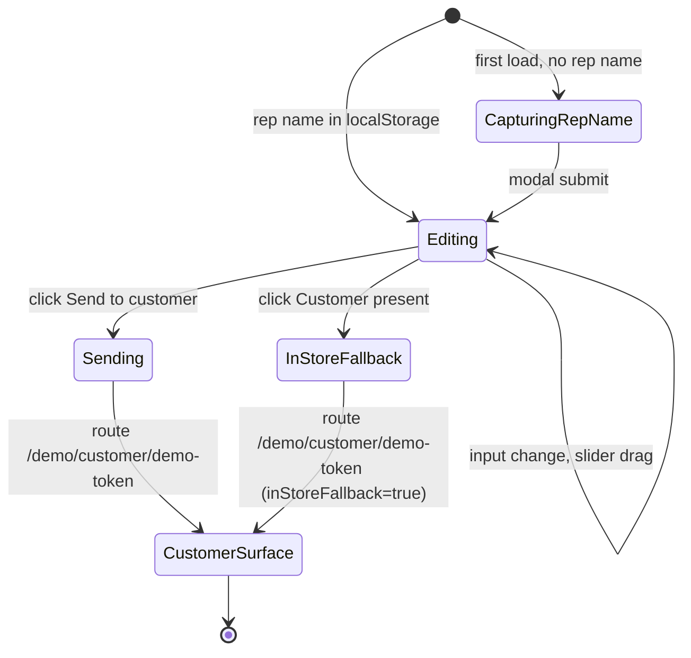

The rep tablet is the visual showpiece. It renders at `/demo/rep` and runs as a single page in landscape on a 1024 px tablet, with responsive degradation to phone.

## Layout

Top bar, full width:

- Skin logo and short name on the left.
- Rep name on the right ("Hi, Aisha"). Captured once on first load via a small modal (`components/rep/rep-name-capture.tsx`) and persisted to localStorage.
- "End of day" link top-right routes to `/demo/admin`.

Body, two-pane:

- **Left pane (40%)**. Inputs: description (textarea, defaults to skin scenario), price (£ input), deposit slider (0% to 50%), customer name, customer email, customer mobile. The customer-capture sub-component (`components/rep/customer-capture.tsx`) groups name plus email plus mobile.
- **Right pane (60%)**. Live finance product cards. One card per `FinanceProduct` in the active skin's catalogue. Each card shows option name, monthly £, total payable £, deposit £, term, key feature one-liner, and any highlight badges.

Bottom action bar:

- Primary: **Send to customer's phone** (Send icon, full-width on tablet).
- Secondary: **Customer present, ack now** (in-store fallback).

## Key user actions

- Type or scrub the price. Cards recompute live.
- Drag the deposit slider. Cards recompute live; badges may swap.
- Type customer details. The send button enables when name, email, and price are non-empty.
- Click **Send to customer's phone**. Writes the `InFlightQuote` into the Zustand store, resets `customerAck`, and routes to `/demo/customer/demo-token`.
- Click **Customer present, ack now**. Same as above, with `inStoreFallback: true`.

## Live computation

Each card computes its values via `computeQuote(product, price, depositPercent)` from `lib/finance-math.ts`. Highlight badges are produced by `badgesForCatalogue(catalogue, price, depositPercent)`, which returns up to one badge per product across three criteria: lowest monthly, lowest total cost, shortest term.

```typescript
import { badgesForCatalogue, computeQuote } from "@/lib/finance-math";
import { getCatalogue } from "@/lib/catalogue";

const catalogue = getCatalogue(skinId);
const badges = badgesForCatalogue(catalogue, price, depositPercent);

const cards = catalogue.map((product) => ({
  product,
  quote: computeQuote(product, price, depositPercent),
  badges: badges[product.id] ?? [],
}));
```

APR is treated as a nominal annual rate compounded monthly. UK regulated APR uses XIRR-style daily compounding under CONC App 1; the demo simplification is documented in `lib/finance-math.ts` and flagged for the production build.

## Data in, data out

| Direction | Field | Source |
|---|---|---|
| In | `skin` | Zustand store |
| In | `defaultScenario` | Skin definition |
| In | `catalogue` | `getCatalogue(skinId)` |
| Out | `inFlightQuote` | Zustand `setInFlightQuote` |
| Out | navigation | `router.push("/demo/customer/demo-token")` |

In production, the **Send to customer's phone** click also fires `POST /quotes` (see [Reference, API routes](/reference/api-routes/)) and the response payload includes the signed magic link URL.

## State machine



## Components

- `components/rep/quote-builder.tsx`: top-level layout and submit handlers
- `components/rep/finance-product-card.tsx`: single product card with computed values and badges
- `components/rep/customer-capture.tsx`: name plus email plus mobile group
- `components/rep/rep-name-capture.tsx`: first-load modal

## Screenshot anchors

- `rep-tablet-default-solaris.png`: default Solaris scenario, Sarah Mitchell, £17,500, 10% deposit
- `rep-tablet-default-hayes.png`: Hayes scenario, James Tate, £24,000, 25% deposit
- `rep-tablet-default-bright-lane.png`: Bright Lane scenario, Priya Shah, £8,400, 0% deposit
- `rep-tablet-deposit-50pct.png`: Solaris with deposit pushed to 50% to show badge swap
