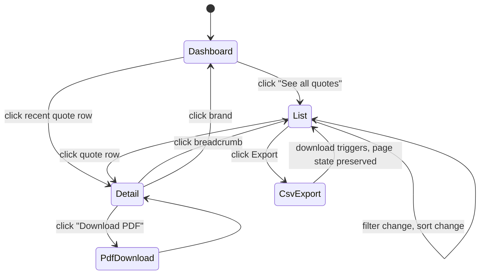

The retailer admin portal renders under `/demo/admin`. It is read-only by design: the retailer reviews evidence rather than editing quotes. Three pages: dashboard, list, detail.

## Pages

### Dashboard, /demo/admin

Top header with retailer short name plus one-line description. Below that:

- **Four KPI tiles**: quotes this week, acknowledgement rate, average quote value, top rep this month.
- **Sparkline**: quotes per day for the last 14 days, rendered by `components/admin/sparkline.tsx`.
- **Recent quotes preview**: top 5 of `getQuotesForSkin(skinId)`, with a "See all quotes" link to the list view.

KPIs are computed by `computeKpis(skinId)` from `lib/fixtures.ts`:

```typescript
const { quotesThisWeek, ackRate, avgValue, topRep, sparkline, total }
  = computeKpis(skinId);
```

### List, /demo/admin/list

Filterable table of all quotes for the active skin. Columns: date, rep, customer, value, status, picked option. Filters: rep (dropdown), status (multi-select chip), date range, value range. CSV export button (downloads a static fixture in v1).

Status badge colours:
- `sent`: slate
- `opened`: sky
- `option-picked`: amber
- `acknowledged`: emerald
- `expired`: rose

### Detail, /demo/admin/quote/[id]

Quote header (id, customer, rep, date, value, status badge), the picked option's full computed quote, the styled PDF preview, and the full audit timeline.

The audit timeline (`components/admin/activity-timeline.tsx`) renders events newest-first. Each event shows the actor (rep, customer, system), description, timestamp, and any structured detail.

## Status distribution and event timeline

For each quote, the fixture seed produces a status with this distribution:

| Status | Probability | Events |
|---|---|---|
| `acknowledged` | 35% | quote-created, quote-sent, magic-link-clicked, option-picked, acknowledgements-confirmed |
| `option-picked` | 25% | quote-created, quote-sent, magic-link-clicked, option-picked |
| `opened` | 20% | quote-created, quote-sent, magic-link-clicked |
| `sent` | 15% | quote-created, quote-sent |
| `expired` | 5% | quote-created, quote-sent, quote-expired |

See `AuditEvent` and `AdminQuote` shapes in [Reference, Data shapes](/reference/data-shapes/).

## Key user actions

- Switch skin via the top-corner skin switcher. Dashboard, list, and detail re-render against the new skin's quotes.
- Filter the list by rep, status, date, value.
- Click a row in the list. Routes to `/demo/admin/quote/[id]`.
- Click "Download PDF" or "CSV export". Both download static fixtures in v1.

## Data in, data out

| Direction | Source / sink |
|---|---|
| In | `getQuotesForSkin(skinId)` from `lib/fixtures.ts` |
| In | `getQuoteById(skinId, id)` for the detail page |
| In | `computeKpis(skinId)` for dashboard tiles |
| Out (planned) | CSV export hits `POST /admin/csv-export` |
| Out (planned) | List filters hit `GET /admin/quotes?rep=&status=&dateFrom=&dateTo=` |

In v1 there is no real auth on the admin portal. In production it sits behind retailer SSO with an RBAC matrix (admin, auditor, read-only). See [Implementation, For retailers, Adoption path](/implementation/retailers/adoption-path/).

## State machine



## Components

- `components/admin/admin-dashboard.tsx`
- `components/admin/admin-list.tsx`
- `components/admin/admin-quote-detail.tsx`
- `components/admin/kpi-tile.tsx`
- `components/admin/quote-table.tsx`
- `components/admin/quote-status-badge.tsx`
- `components/admin/sparkline.tsx`
- `components/admin/activity-timeline.tsx`

## Screenshot anchors

- `admin-dashboard-solaris.png`: Solaris KPIs and sparkline
- `admin-list-filtered.png`: list filtered to status=acknowledged
- `admin-detail-acknowledged.png`: full timeline including all five events
- `admin-detail-expired.png`: short timeline showing the expiry path
