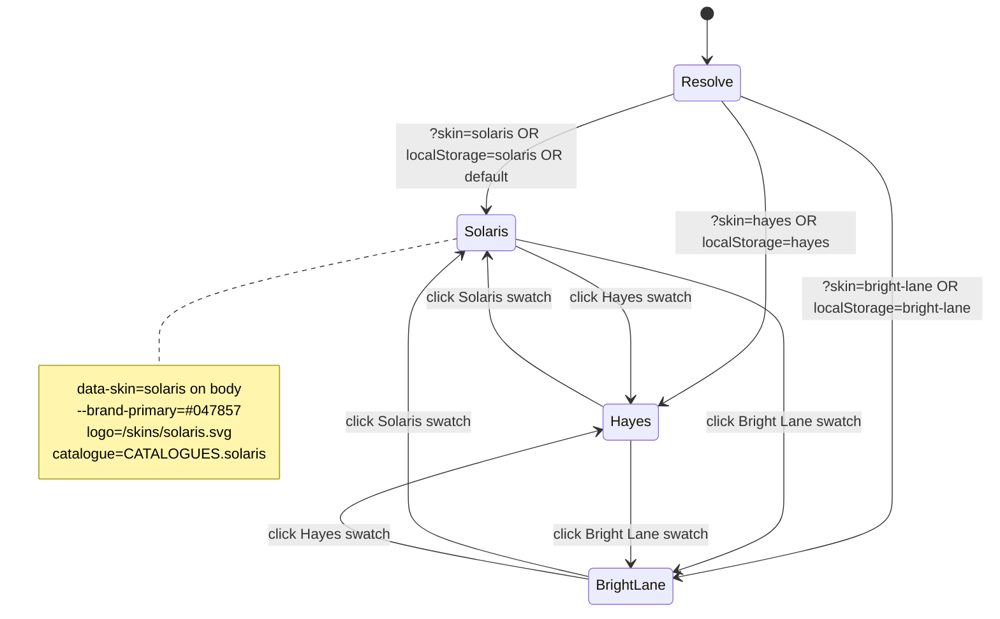

The skin switcher is a presentation-only control. Switching skins changes nothing about the underlying state machine. It cycles between the three retailer skins defined in `lib/skins.ts`.

## Where it appears

- All four surfaces (marketing, rep, customer, admin) when the demo is in **free-explore mode** or when the URL carries `?skin=`.
- Hidden during the scripted walkthrough (the walkthrough locks to one skin per step). A "Skip walkthrough" link top-right exits to free-explore and reveals the switcher.

The switcher lives in `components/shell/skin-switcher.tsx` and renders three swatch tiles, each labelled with the skin's short name and showing its `swatchHex` colour.

## What changes when the skin changes

| Surface | Element | Source |
|---|---|---|
| All | `--brand-primary` CSS variable | `data-skin` attribute on `<body>`, read by `globals.css` |
| All | Brand logo | `public/skins/{skinId}.svg` via `components/shell/skin-logo.tsx` |
| All | Footer compliance text | `RetailerSkin.footerText` |
| All | FCA register number | `RetailerSkin.fcaRegisterNumber` |
| Marketing | Hero preview defaults | `RetailerSkin.defaultScenario` |
| Rep tablet | Form defaults | `RetailerSkin.defaultScenario` |
| Rep tablet | Finance product cards | `getCatalogue(skinId)` |
| Customer phone | Comparison grid | `getCatalogue(skinId)` |
| Admin | KPIs, list, detail | `getQuotesForSkin(skinId)` |

What does **not** change: typography (Geist plus Geist Mono), motion language, layout, copy. Skin switching is a brand layer over a fixed information architecture.

## Persistence

Skin selection is held in three places, in priority order:

1. URL `?skin=solaris|hayes|bright-lane`. Highest priority.
2. localStorage key `lap-demo-state` (Zustand `persist` middleware).
3. `DEFAULT_SKIN_ID` constant from `lib/skins.ts`. Currently `solaris`.

The persona switcher syncs URL state on every change so a deep-linked demo URL is shareable.

## State machine

## Adding a fourth skin

A new skin is one file edit in `lib/skins.ts`, one entry in `lib/catalogue.ts`, and one SVG in `public/skins/`. See [Reference, Skin definition](/reference/skin-definition/) for the field-by-field walkthrough.

## What the switcher is not

- It is not multi-tenancy. Skin switching does not gate access to any retailer's data; in v1 there is no per-tenant data at all.
- It is not theme switching. Light and dark mode are independent of skin. The demo respects `prefers-color-scheme` via `next-themes`.
- It is not a retailer SSO surface. In production, a retailer admin would land on their own skin via their SSO; the in-product switcher is a demo affordance.
