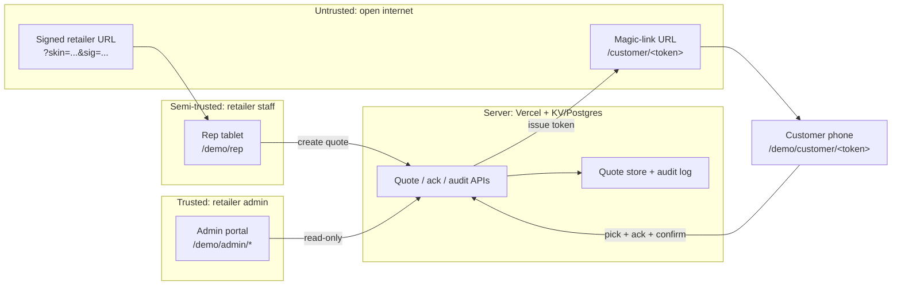

This page enumerates the threats facing each surface of Lending Agent Presenter, the technical mitigations that address them, and the residual risk that remains. The decomposition follows the STRIDE pattern (spoofing, tampering, repudiation, information disclosure, denial of service, elevation of privilege), surface by surface, because the trust assumptions and the available mitigations differ sharply between the rep tablet, the customer phone, the retailer admin portal, and the magic-link issuance flow.

## Trust boundaries

The diagram shows three trust zones. The signed retailer URL and the magic-link URL are in the untrusted zone (the open internet) and must defend themselves. The rep tablet is semi-trusted; possession of the retailer URL plus a free-text rep name string is the only credential. The admin portal is trusted, behind retailer SSO in production. The server boundary holds the quote store, the audit log, and the rate limiters.

## Surface 1: rep tablet (`/demo/rep`)

The rep tablet is opened by a sales rep using a signed retailer URL. There is no per-rep authentication; rep name is captured once via a localStorage modal. The threat surface is everything in front of the quote-creation API.

**Spoofing.** An attacker who obtains a retailer URL can pose as any rep at that retailer to the browser. Mitigation: the URL is signed (HMAC-SHA256 over `{retailerId, kid, expiry}` with a server-side secret, rotated quarterly), so a tampered URL fails signature verification at the API layer. URLs are short-lived (24h) and rotated to staff weekly. Possession of a leaked URL still allows rep-impersonation for its lifetime; this is the dominant residual risk on this surface.

**Tampering.** A rep cannot alter the finance product catalogue or APRs from the tablet; the catalogue is server-rendered from `lib/catalogue.ts`. A rep can enter any price, deposit percent, customer name, email, and mobile they like. Mitigation: server-side validation against per-skin price bounds; KYC-grade identity verification is the lender's job, not Presenter's.

**Repudiation.** A rep could later deny issuing a quote. Mitigation: every quote-create writes an audit event with the (claimed) rep name, the retailer URL `kid`, the IP, the user-agent, and a server-assigned timestamp. The rep-name string is not authentication, but it is evidence and it is recorded verbatim.

**Information disclosure.** The tablet renders quote details server-side after a successful HMAC verification. No raw customer PII is committed to URL parameters. Browser history on a shared tablet would expose recently typed customer details; mitigation guidance recommends a per-shift "End of day" link that clears localStorage and triggers tab close.

**Denial of service.** The rep tablet calls the quote-create endpoint. Without rate limiting, an attacker with a leaked URL could enumerate quote IDs or flood email/SMS providers. Mitigation: 10 quote-creates per minute per signed URL, 50 per hour. Detail in [rate-limiting](../rate-limiting/).

**Elevation of privilege.** The rep tablet has no path to the admin portal. The admin portal sits behind retailer SSO with its own session. There is no shared cookie. A compromised rep tablet cannot read other quotes or alter the audit log.

**Residual risk.** Rep impersonation via a leaked URL for the URL's remaining lifetime. Quote spam against valid emails/mobiles up to the rate-limit ceilings. The first is bounded by URL rotation cadence; the second is bounded by the limiter and by per-customer email-send fan-out caps the email provider enforces.

## Surface 2: customer phone (`/demo/customer/<token>`)

The customer phone surface opens from a magic-link sent by SMS or email. The token is a base64url-encoded HMAC-SHA256 over `(quoteId, expiry, nonce)`, signed with a `kid`-rotated server secret.

**Spoofing.** The link can be forwarded, screenshotted, or phished. Mitigation: the token binds to a specific quote ID and a specific expiry (default 14 days from issue). After the customer confirms, the token is added to a one-shot blocklist; further opens render a read-only "already confirmed on `<date>`" state. Pre-confirmation, the token can be opened multiple times by the legitimate recipient or anyone they show the link to; this is unavoidable for an emailed receipt and is consistent with how every retailer-issued receipt link works today.

**Tampering.** Token tampering fails HMAC verification. Quote-content tampering on the wire is prevented by TLS. The customer cannot change the quote payload from their device; the option-pick and acknowledgement flags are what they write back, and only those.

**Repudiation.** A customer could later deny picking a particular option or ticking a particular acknowledgement. Mitigation: the audit log records each acknowledgement with the verbatim text shown (the four strings from `components/customer/acknowledgement-checklist.tsx`), the chosen `productId`, the IP, the user-agent, and a server-assigned `confirmedAt` timestamp. The audit-as-evidence design is detailed in [audit as evidence](../../regulatory/audit-as-evidence/).

**Information disclosure.** The token does not contain PII. The page payload is fetched server-side after token verification and includes only the fields the customer needs to see (their own quote and their own contact details). A leaked token discloses one customer's quote, no others.

**Denial of service.** Magic-link open spam (5/min per token) and confirm-attempt spam are rate-limited. SMS/email send is capped per quote (one initial issue, one re-send within the link lifetime, hard-stop after that).

**Elevation of privilege.** The customer surface has no admin access. A token is bound to one quote and reads only that quote. There is no enumeration path through quote IDs because IDs are unguessable (UUIDv4) and the token is required.

**Residual risk.** Forwarded magic-link allowing acknowledgement by someone other than the named customer. Mitigation in production should add an SMS-OTP-on-confirm or a "name match" challenge if the retailer wants stronger binding; the demo records the IP and user-agent and accepts that the contractual customer is the named recipient. This is consistent with how online retailers operate today and is documented in the privacy section.

## Surface 3: retailer admin portal (`/demo/admin/*`)

The admin portal is the read-only oversight surface for the retailer. In the demo it is open; in production it sits behind retailer SSO with a session-cookie auth scheme.

**Spoofing.** Production: enforced by the SSO IdP. Demo: the demo is intentionally open and is documented as such on every admin page footer.

**Tampering.** The admin portal is read-only. No write paths exist for quote content or audit events. Quote status (sent, opened, acknowledged, expired) is derived from audit-log events, not editable.

**Repudiation.** Admin reads are themselves logged (who opened which quote detail page, when). This forms the chain of custody for any later defence.

**Information disclosure.** A compromised admin session exposes every quote in the retailer's tenant. Mitigation: SSO + IP allowlist for the production admin portal, MFA on the IdP, session timeout (30 min idle, 8h absolute). The KPI dashboard does not expose customer PII; the list and detail views do, by necessity.

**Denial of service.** 30 admin reads per minute per session, sufficient for human pace and bounded against scrape behaviour.

**Elevation of privilege.** No admin user can write to the audit log. The audit-log store is append-only at the storage layer (Postgres `INSERT`-only role, or a write-once KV abstraction). Detail in [tampering and replay](../tampering-and-replay/).

**Residual risk.** Account takeover at the retailer's IdP. This is the retailer's responsibility to manage and is addressed in the implementation/for-retailers section.

## Surface 4: magic-link issuance (server-side)

Magic-link tokens are issued by the server when a rep clicks "Send to customer". Issuance happens entirely server-side; the token is delivered to the customer via the email provider (Postmark or SES) and SMS provider (Twilio or MessageBird).

**Spoofing.** A request to issue a link must come from a valid rep-tablet session (verified by the signed retailer URL plus the in-flight quote being created in the same session). Server validates both before calling the email/SMS providers.

**Tampering.** Token contents are HMAC-signed. Email/SMS bodies are template-rendered server-side, not composed by any client.

**Repudiation.** Issuance writes an audit event (`quote.sent`) with the recipient email, the recipient mobile (last 4 only in the audit log; full numbers in the operational queue with shorter retention), the rep name, and the timestamp.

**Information disclosure.** The email and SMS bodies contain the customer's name, the goods description, and the magic link. They do not contain APRs, deposit, or monthly figures; the customer must open the link to see those, which limits exposure if the message is forwarded to a wrong address.

**Denial of service.** Send-volume caps per quote (max 2 sends per quote, 1 initial + 1 re-send) and per retailer per hour (configurable per tenant, default 200). Bounce handling reverts the quote status to `failed_to_send` rather than retrying indefinitely.

**Elevation of privilege.** Issuance has no path to the admin portal or to other tenants' quotes. The server-side issuance code is the only path to the email/SMS providers; provider API keys are server-only env vars.

**Residual risk.** Email provider compromise (a sub-processor risk, covered in [sub-processors](../../privacy/sub-processors/)). Mis-typed customer email leading to magic-link delivery to a wrong recipient; this is bounded by the post-confirmation blocklist (a wrong recipient who opens but does not confirm leaves no permanent acknowledgement, and the link expires).

## What is out of scope

Network-layer threats (TLS, BGP, edge DDoS) are inherited from Vercel and are out of scope. Platform-level Vercel compromise is out of scope and is covered by Vercel's own SOC 2 and ISO 27001 attestations. Browser-level exploits on the customer's phone are out of scope.

The next sibling pages (rate limiting, vulnerable customer protection, tampering and replay) drill into the specific mitigations called out above.
